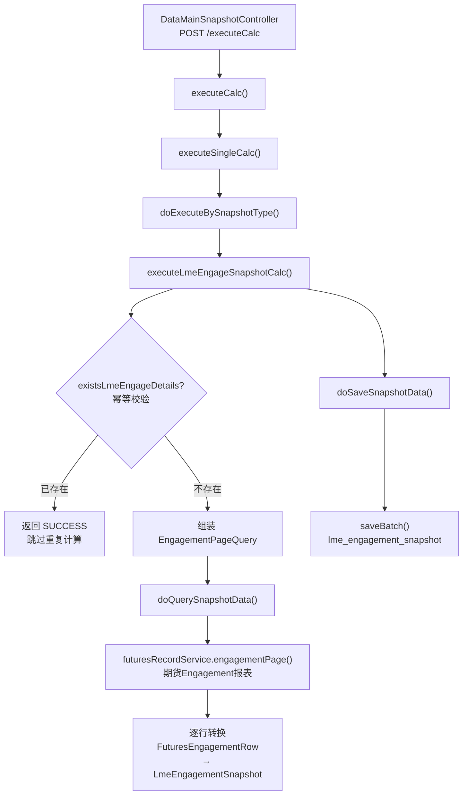

# LME头寸快照计算 — 调用链梳理

> **业务含义**：从期货 Engagement 报表拉取截至快照日期的已定价未交割头寸数据，直接转为快照落库。逻辑相对简单，不涉及金属拆分计算。

---

## 一、调用链路图



---

## 二、数据收集阶段（核心）

### 2.1 请求参数组装

```java
EngagementPageQuery query = new EngagementPageQuery();
query.setQueryDate(snapshotDate);              // 快照日期
query.setTradingEndDay(snapshotDate);          // 交易截止日 = 快照日期
query.setPromptBeginDate(snapshotDate + 1天);  // 提示开始日 = 快照日期次日
query.setLegalEntityId(psSnapshot.getLegalEntityId());
query.setPage(1);
query.setSize(-1);  // 不分页，全量加载
```

**参数含义解释**：
- `queryDate`：查询基准日，筛选截至该日期仍有效的头寸
- `tradingEndDay`：交易截止日，筛选交易日 ≤ 该日期的记录
- `promptBeginDate`：提示日开始，筛选交割日 > 快照日期的记录（即"未交割"）

### 2.2 主数据源：期货 Engagement 报表

**方法**：`futuresRecordService.engagementPage(query)`

**返回**：`CommonPage<FuturesEngagementRow>`

**数据来源**：
- `physical_deal_line`（实物交易行）
- `physical_deals`（实物交易主表）
- `product`（商品）
- `sys_company`（业务机构）
- 关联期货合约、定价数据

**筛选条件**（由 engagementPage 内部实现）：
- 已定价（priced = true）
- 未交割（交割日 > 快照日期）
- 按机构过滤

### 2.3 数据转换

**方法**：`doQuerySnapshotData(query, dataMainSnapshotId)`（LmeEngagementSnapshotServiceImpl L146）

逐行将 `FuturesEngagementRow` 转换为 `LmeEngagementSnapshot`：

```java
for (FuturesEngagementRow row : content) {
    LmeEngagementSnapshot item = new LmeEngagementSnapshot();
    item.setId(SnowFlakeUtil.generateId());
    item.setDataMainSnapshotId(dataMainSnapshotId);
    // 复制：法律实体、交易对手、合同号、商品信息、量、价格、金额等
    // 设置审计字段：createdBy, createdTime, inactiveFlag
}
```

---

## 三、落库

**目标表**：`lme_engagement_snapshot`

**事务**：`@Transactional(transactionManager = "systemTransactionManager")`

**写入字段与数据来源**：

| 字段 | 来源 | 说明 |
|------|------|------|
| `id` | `SnowFlakeUtil.generateId()` | 雪花ID |
| `dataMainSnapshotId` | 参数传入 | 关联月结快照主表 |
| 法律实体 | `FuturesEngagementRow.legalEntityId` | 业务机构 |
| 交易对手 | `FuturesEngagementRow.counterpartyId` | 交易对手 |
| 合同号 | `FuturesEngagementRow.contractNumber` | 合同号 |
| 商品信息 | `FuturesEngagementRow.productId/productName` | 商品 |
| 量 | `FuturesEngagementRow.engagementQuantity` | 头寸数量 |
| 价格 | `FuturesEngagementRow.price` | 单价 |
| 金额 | `FuturesEngagementRow.amount` | 金额 |
| 交割日期 | `FuturesEngagementRow.deliveryDate` | 交割日 |
| 审计字段 | `createdBy`, `createdTime`, `inactiveFlag` | 系统字段 |

**转换逻辑**：

```java
for (FuturesEngagementRow row : content) {
    LmeEngagementSnapshot item = new LmeEngagementSnapshot();
    item.setId(SnowFlakeUtil.generateId());
    item.setDataMainSnapshotId(dataMainSnapshotId);
    BeanUtils.copyProperties(row, item);  // 直接复制字段
    item.setCreatedBy(currentUser);
    item.setCreatedTime(LocalDateTime.now());
    item.setInactiveFlag(false);
}
```

---

## 四、重要业务备注

1. **幂等保护**：计算前检查 `existsLmeEngageDetails()`，已存在则跳过
2. **无计算逻辑**：与其他快照不同，LME 头寸快照**不涉及金属成分拆分或估值计算**，仅做数据搬运
3. **全量加载**：`size = -1` 不分页，一次性加载所有头寸
4. **与 EOM Engagement 报表的关系**：数据源相同（`futuresRecordService.engagementPage()`），但 EOM Engagement 报表（⑧）是只读查询，本快照会落库
5. **EngagementPageQuery 组装逻辑**：与 `DataMainSnapshotServiceImpl` 第 337 行注释中描述的查询条件一致
