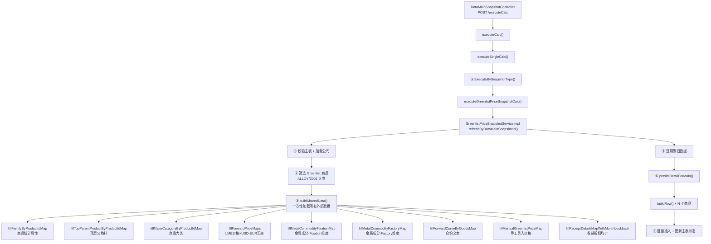

# Greenlist价格快照计算 — 调用链梳理

> **业务含义**：为每个商品计算 Greenlist 单价（LME 基准 + 月均折扣）和 Adder（Greenlist 价 - LME 等价），是采购/销售快照金属估值的基础数据。逻辑最复杂的快照类型。

---

## 一、调用链路图



---

## 二、数据收集阶段（核心）

### 2.1 buildSharedData() — 一次性加载所有外部数据

| fill 方法 | 数据来源表 | 说明 |
|-----------|-----------|------|
| `fillFamilyByProductIdMap()` | `product_statistical_attributes` | 商品→统计属性(family) |
| `fillTopParentProductByProductIdMap()` | `product`（内存解析 parent_id 链） | 商品→顶层父物料 |
| `fillMajorCategoryByProductIdMap()` | `product_category` | 商品→商品大类 |
| `fillForwardPriceMaps()` | `forward_price`（经 Mapper） | LME Cash/Lowest 价格 + USD-EUR-Bloomberg 汇率 |
| `fillMetalCommodityFixationMap()` | `product_specification`(Fixation) + `forward_curve` | 金属成分占比（Fixation 维度） |
| `fillMetalCommodityFactoryMap()` | `product_specification`(Factory) + `forward_curve` | 金属成分占比（Factory 维度） |
| `fillForwardCurveByGoodsMap()` | `forward_curve` | 合约文本（按 goods 分组） |
| `fillManualGreenlistPriceMap()` | `greenlist_price_manual_history` | 手工录入的 Greenlist 价格 |
| `fillReceiptDetailsMapWithMonthLookback()` | `reportService.receiptDetails()` | 收货明细折扣均价（当月缺失往前回补最多3个月） |
| `fillFactoryLegalMap()` | `abutment_config_details`(Factory) | 公司ID→工厂类别 |

### 2.2 LME 远期价格加载细节

- 取前3个交易日的 LME 结算价（MarketPriceType=SETTLEMENT_PRICE，Marker=Cash/Lowest）
- 筛选条件：`session = "0"`, `publication_id = 1`（LME）, `currency_id = 25`（USD）, `curveType = "Spot"`
- 同一合约保留**最新交易日**的价格
- **USD→EUR 汇率**：取 `forward_curve_name = "USD-EUR-Bloomberg"`, `currency_id = 2`(EUR), `publication_id = 3`, Marker=Cash 的最新值

---

## 三、逐行计算逻辑 — buildRow()

### 3.1 基础字段

- `articleCategory` = 商品大类名称
- `family` = 统计属性中的 family
- `alloyCode` = 顶层父物料的 code

### 3.2 金属占比设置

- **Fixation 维度**：遍历金属成分列表，设置 Cu/Ni/Sn/Al/Zn/Pb 的 `pct`
- **LME 行情**：对 6 种金属逐一调用 `resolveLmeByElement()` → 按元素符号查 ForwardCurve → 取价格 × USD-EUR 汇率
- **Factory 维度**：按公司对应的工厂类别过滤，设置 `pctFactory`
- **YieldPctFactory**：取 Factory 列表中 `SpecificationType=Yield` 且匹配工厂类别的值

**金属占比计算公式**：

| 字段 | 维度 | 计算公式 | 说明 |
|------|------|---------|------|
| `cuPct` | Fixation | `spec.defaultValue` | CU 成分占比（%） |
| `znPct` | Fixation | `spec.defaultValue` | ZN 成分占比（%） |
| `pbPct` | Fixation | `spec.defaultValue` | PB 成分占比（%） |
| `alPct` | Fixation | `spec.defaultValue` | AL 成分占比（%） |
| `snPct` | Fixation | `spec.defaultValue` | SN 成分占比（%） |
| `niPct` | Fixation | `spec.defaultValue` | NI 成分占比（%） |
| `cuPctFactory` | Factory | `spec.defaultValue` | CU 成分占比（%）- Factory 维度 |
| `znPctFactory` | Factory | `spec.defaultValue` | ZN 成分占比（%）- Factory 维度 |
| `pbPctFactory` | Factory | `spec.defaultValue` | PB 成分占比（%）- Factory 维度 |
| `alPctFactory` | Factory | `spec.defaultValue` | AL 成分占比（%）- Factory 维度 |
| `snPctFactory` | Factory | `spec.defaultValue` | SN 成分占比（%）- Factory 维度 |
| `niPctFactory` | Factory | `spec.defaultValue` | NI 成分占比（%）- Factory 维度 |
| `yieldPctFactory` | Factory | `spec.defaultValue` | Yield 折率（%）- Factory 维度 |

**LME 价格计算公式**：

```java
// 对每种金属，从 ForwardCurve 查询价格
for (metal in ["CU", "ZN", "PB", "AL", "SN", "NI"]) {
    // 查询 LME 结算价（USD/吨）
    BigDecimal lmePriceUsd = resolveLmeByElement(metal, curveId);
    
    // 转换为 EUR/吨
    BigDecimal lmePriceEur = lmePriceUsd × usdEurExchangeRate;
    
    // 设置到快照字段
    switch(metal) {
        case "CU": snapshot.setLmeCu(lmePriceEur); break;
        case "ZN": snapshot.setLmeZn(lmePriceEur); break;
        case "PB": snapshot.setLmePb(lmePriceEur); break;
        case "AL": snapshot.setLmeAl(lmePriceEur); break;
        case "SN": snapshot.setLmeSn(lmePriceEur); break;
        case "NI": snapshot.setLmeNi(lmePriceEur); break;
    }
}
```

### 3.3 Marker 与 LmeForGreenlist（核心公式）

| 商品大类 | Marker | LmeForGreenlist 取值 |
|----------|--------|---------------------|
| Z003/Z002/Alloy（合金/半成品/成品） | `"Alloy"` | `allPriceCashMap[curveId]`（该商品对应合约文本的 Cash 价格） |
| Z001 + family=000（New Metal） | `"Cash"` | `Σ(各金属pct × LME价格)`（按 Fixation 占比加权） |
| Z001 + family=040（Scrap） | `"Lowest"` | `Σ(各金属pct × LME价格)`（同上，但 LME 用 Lowest 价格） |

**详细计算公式**：

```java
// 1. Alloy/半成品/成品
if (articleCategory in ["Z003", "Z002", "Alloy"]) {
    marker = "Alloy";
    lmeForGreenlist = allPriceCashMap.get(curveId);  // 直接取合约的 Cash 价格
}

// 2. 原材料 - New Metal (family=000)
if (articleCategory == "Z001" && family == "000") {
    marker = "Cash";
    lmeForGreenlist = 
        cuPct × lmeCu + 
        znPct × lmeZn + 
        pbPct × lmePb + 
        alPct × lmeAl + 
        snPct × lmeSn + 
        niPct × lmeNi;  // 按 Fixation 占比加权求和
}

// 3. 原材料 - Scrap (family=040)
if (articleCategory == "Z001" && family == "040") {
    marker = "Lowest";
    lmeForGreenlist = 
        cuPct × lmeCuLowest + 
        znPct × lmeZnLowest + 
        pbPct × lmePbLowest + 
        alPct × lmeAlLowest + 
        snPct × lmeSnLowest + 
        niPct × lmeNiLowest;  // 按 Fixation 占比加权求和，使用 Lowest 价格
}

snapshot.setMarker(marker);
snapshot.setLmeForGreenlist(lmeForGreenlist);
```

### 3.4 LME Equivalent

```
LmeEquivalent = Σ(金属Factory占比 × 对应LME价格) × YieldPctFactory
```

即 6 种金属 (Cu/Zn/Pb/Al/Sn/Ni) 的 `pctFactory × lme` 之和再乘以折率。

**详细计算公式**：

```java
// 1. 计算各金属的 Factory 加权价格
BigDecimal metalWeightedSum = 
    cuPctFactory × lmeCu + 
    znPctFactory × lmeZn + 
    pbPctFactory × lmePb + 
    alPctFactory × lmeAl + 
    snPctFactory × lmeSn + 
    niPctFactory × lmeNi;

// 2. 乘以 Yield 折率
BigDecimal lmeEquivalent = metalWeightedSum × yieldPctFactory;

snapshot.setLmeEquivalent(lmeEquivalent);
```

### 3.5 月均折扣/溢价

- 从 `receiptDetailsMap` 按 `companyId:productId` 取值
- 计算方式：`totalDiscount合计 ÷ receiptQuantityTo合计`（保留5位小数）
- 当月无数据时向前回补最多3个月

**详细计算公式**：

```java
// 从收货明细查询折扣数据
ReceiptDetailsMapKey key = companyId + ":" + productId;
BigDecimal totalDiscount = receiptDetailsMap.get(key).totalDiscount;
BigDecimal receiptQuantityTo = receiptDetailsMap.get(key).receiptQuantityTo;

// 计算月均折扣/溢价
BigDecimal averagePremiumDiscount = totalDiscount ÷ receiptQuantityTo;

// 如果当月无数据，向前回补最多3个月
if (averagePremiumDiscount == null && monthLookback > 0) {
    averagePremiumDiscount = loadFromPreviousMonth(companyId, productId, monthLookback);
}

snapshot.setAveragePremiumDiscount(averagePremiumDiscount);
```

### 3.6 Greenlist 单价 & Adder

```
GreenlistPrice = 有手工价 ? 手工价 : LmeForGreenlist + 月均折扣
Adder = GreenlistPrice - LmeEquivalent  （保留5位小数）
```

**详细计算公式**：

```java
// 1. 检查是否有手工录入的 Greenlist 价格
BigDecimal manualPrice = manualGreenlistPriceMap.get(legalEntityId + ":" + productId);

// 2. 计算 Greenlist 单价（EUR/吨）
BigDecimal greenlistPriceEurPerTo;
if (manualPrice != null) {
    greenlistPriceEurPerTo = manualPrice;  // 使用手工价
} else {
    greenlistPriceEurPerTo = lmeForGreenlist + averagePremiumDiscount;  // LME + 折扣
}

// 3. 计算 Adder（EUR/吨）
BigDecimal adder = greenlistPriceEurPerTo - lmeEquivalent;

snapshot.setGreenlistPriceEurPerTo(greenlistPriceEurPerTo);
snapshot.setAdder(adder);
```

**字段说明**：
- `greenlistPriceEurPerTo`：Greenlist 单价（EUR/吨）
- `lmeEquivalent`：LME 等价单价（EUR/吨）
- `adder`：Adder 单价（EUR/吨），= Greenlist - LME
- `averagePremiumDiscount`：月均折扣/溢价（EUR/吨）

---

## 四、落库

| 操作 | 目标表 | 说明 |
|------|-------|------|
| 逻辑删旧 | `greenlist_price_snapshot` | `inactive_flag = 1` |
| 批量插入 | `greenlist_price_snapshot` | 每100条一批 `insertBatch` |
| 系统价格历史 | `greenlist_price_manual_history` | 先删旧系统记录，再按维度补录(sourceType=2) |
| 主表状态 | `data_main_snapshot` | calc_status=Executed, status=Committed |
| 同月其他主表失效 | `data_main_snapshot` | 同月同机构同类型、ID不同的主表 inactive_flag=1 |

---

## 五、重要业务备注

1. **Family 决定价格类型**：family=`"040"` 为 Scrap（废料），使用 LME **Lowest** 价格；其他使用 **Cash** 价格
2. **商品大类决定 Marker 和 LmeForGreenlist 算法**：Alloy/半成品/成品直接取合约 Cash 价；原材料(Z001)按金属占比加权求和
3. **手工价覆盖机制**：`greenlist_price_manual_history` 中 sourceType=1(手工) 的记录优先级高于系统计算
4. **收货折扣月回补**：当月无收货折扣数据时，按月向前回补最多3个月
5. **USD→EUR 汇率**：所有 LME 价格最终乘以 `USD_EUR_Bloomberg` 汇率转换为欧元
6. **精度**：Greenlist 单价保留5位小数，`RoundingMode.HALF_UP`
7. **公司→publication 映射**：MEB=6, KMB=7, TMB=8，用于匹配合约文本
8. **幂等设计**：每次重算先逻辑删旧数据再重建；主表 CAS 抢占防止并发执行
9. **被其他快照依赖**：采购快照(①)和销售快照(②)都引用 Greenlist 快照数据进行估值
