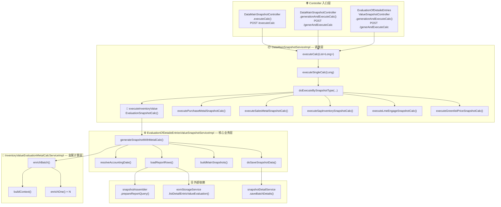
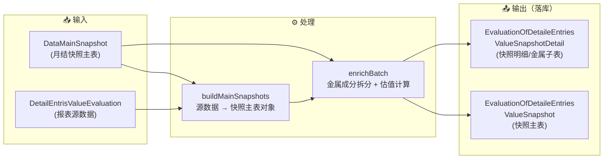

# 月度入库金属价值明细计算 — 调用链梳理

> 以 `executeInventoryValueEvaluationSnapshotCalc`（第 956 行）为核心，向上追溯入口、向下展开业务逻辑。
>
> **业务含义**：按月结快照维度，拉取月度入库明细数据，拆分金属成分并计算各金属估值，生成快照主表 + 金属明细子表落库。

---

## 一、全局调用关系图



---

## 二、逐层方法说明

### 2.1 Controller 入口层（3 个入口）

| # | 方法 | 路径 | 说明 |
|---|------|------|------|
| 1 | `DataMainSnapshotController.executeCalc()` | `POST /executeCalc` | 对**已有**快照执行计算，传入单个快照 ID |
| 2 | `DataMainSnapshotController.generationAndExecuteCalc()` | `POST /generAndExecuteCalc` | **采购/销售报表**上的快捷按钮：生成快照 → 提交 → 计算，一步到位 |
| 3 | `EvaluationOfDetaileEntriesValueSnapshotController.generationAndExecuteCalc()` | `POST /generAndExecuteCalc` | **月度入库金属价值明细**上的快捷按钮：同上流程，但多了提交结果校验 |

三个入口最终都调用 → `DataMainSnapshotServiceImpl.executeCalc(List<Long>)`

---

### 2.2 调度层 — DataMainSnapshotServiceImpl

```
executeCalc(List<Long> ids)
│
├─ 遍历每个 ID
│   └─ 分布式锁（60s 超时，key = "psSnapshot:executeCalc:{id}"）
│       └─ executeSingleCalc(id)
│           │
│           ├─ 查询快照主表：dataMainSnapshotService.getById(id)
│           ├─ 解析快照类型：resolveSnapshotType(snapshotType)
│           │
│           └─ doExecuteBySnapshotType(id, psSnapshot, snapshotEnum)
│               │
│               ├─ switch(snapshotEnum)
│               │   ├─ PurchaseMetalSnapshot       → executePurchaseMetalSnapshotCalc()
│               │   ├─ SalesMetalSnapshot           → executeSalesMetalSnapshotCalc()
│               │   ├─ SapInventorySnapshot         → executeSapInventorySnapshotCalc()
│               │   ├─ LmeEngageSnapshot            → executeLmeEngageSnapshotCalc()
│               │   ├─ GreenlistPriceSnapshot       → executeGreenlistPriceSnapshotCalc()
│               │   └─ InventoryValueEvaluationSnapshot
│               │       → 🎯 executeInventoryValueEvaluationSnapshotCalc()  ← 你关注的方法
│               │
│               └─ 失败时 → markInitStatus() 回退状态
```

**🎯 `executeInventoryValueEvaluationSnapshotCalc(id, psSnapshot)`**（第 956 行）：

```java
// 伪代码，实际代码在第 956-969 行
private BaseResultEntity<?> executeInventoryValueEvaluationSnapshotCalc(Long id, DataMainSnapshot psSnapshot) {
    DetailEntrisValueEvaluationQuery query = new DetailEntrisValueEvaluationQuery();
    try {
        evaluationOfDetaileEntriesValueSnapshotService.generateSnapshotWithMetalCalc(query, id, psSnapshot);
    } catch (Exception e) {
        return BaseResultEntity.fail(resolveCalcErrorMessage(e));
    }
    return BaseResultEntity.success();
}
```

职责很简单：**创建空查询参数 → 委托给核心业务层 → 捕获异常转为可读错误信息**。

---

### 2.3 核心业务层 — EvaluationOfDetaileEntriesValueSnapshotServiceImpl

**`generateSnapshotWithMetalCalc(query, dataMainSnapshotId, psSnapshot)`**（第 173 行）：

```
generateSnapshotWithMetalCalc()
│
├─ ① 参数校验（query / id / psSnapshot 非空）
│
├─ ② resolveAccountingDate(psSnapshot, query)
│   ├─ 优先用 query.accountingDate
│   ├─ 其次用快照的 YearMonth 月末
│   └─ 兜底用 psSnapshot.date
│
├─ ③ loadReportRows(query, psSnapshot)  ← 取数
│   ├─ snapshotAssembler.prepareReportQuery(query, psSnapshot)  // 填充查询条件
│   └─ eomStorageService.listDetailEntrisValueEvaluation(query)  // 从报表取数据
│       └─ 空则抛 BizException("未查询到可快照数据")
│
├─ ④ buildMainSnapshots(sourceRows, id, accountingDate)  ← 转换
│   └─ 遍历 sourceRows → snapshotAssembler.toSnapshotMain() → 设 ID/创建人/时间
│
├─ ⑤ inventoryValueEvaluationMetalCalcService.enrichBatch(...)  ← 金属计算（核心）
│   └─ 见 2.4 节
│
└─ ⑥ doSaveSnapshotData(toSave, allDetails)  ← 落库
    └─ 事务内：saveBatch(主表, 100) + snapshotDetailService.saveBatchDetails(子表)
```

---

### 2.4 金属计算层 — InventoryValueEvaluationMetalCalcServiceImpl

**`enrichBatch(snapshots, sourceRows, psSnapshot)`**（第 106 行）：

```
enrichBatch()
│
├─ buildContext(psSnapshot, sourceRows)  ← 一次性加载公共数据
│   （包含：成品映射、Yield 规格 ID、LME/Bloomberg 结算价、Scorporo 行情等）
│
└─ for each (snapshot, sourceRow):
    └─ enrichOne(snapshot, row, psSnapshot, ctx, user, now)
        │
        ├─ 判断成品/原料（finishedProductMap）→ 设 articleCategory
        ├─ resolveCompositionProductId() → 确定成分产品
        ├─ listMetalSpecForComposition() → 查金属规格
        │   └─ 空 → fillMetalloOnly()（仅填金属信息，跳过计算）
        │
        ├─ 计算净重：netWeightKg = receivedKg × yieldRatio
        ├─ 遍历金属规格 → 计算各金属含量占比 → compositionTot
        ├─ 加载价格数据 → 计算各金属估值
        └─ 返回 InventoryValueEvaluationMetalCalcResult(snapshot + details)
```

---

## 三、数据流向图



---

## 四、关键类/文件速查表

| 类名 | 文件位置 | 职责 |
|------|---------|------|
| `DataMainSnapshotController` | `rest/DataMainSnapshotController.java` | HTTP 入口 |
| `EvaluationOfDetaileEntriesValueSnapshotController` | `rest/EvaluationOfDetaileEntriesValueSnapshotController.java` | 月度入库金属价值明细 HTTP 入口 |
| `DataMainSnapshotServiceImpl` | `service/impl/DataMainSnapshotServiceImpl.java` | 快照调度：锁 → 类型路由 → 执行 |
| `EvaluationOfDetaileEntriesValueSnapshotServiceImpl` | `service/impl/EvaluationOfDetaileEntriesValueSnapshotServiceImpl.java` | 核心：取数 → 转换 → 金属计算 → 落库 |
| `InventoryValueEvaluationMetalCalcServiceImpl` | `service/impl/InventoryValueEvaluationMetalCalcServiceImpl.java` | 金属成分拆分与估值计算 |
| `EvaluationOfDetaileEntriesValueSnapshotAssembler` | `assembler/EvaluationOfDetaileEntriesValueSnapshotAssembler.java` | 对象转换 & 查询参数组装 |
| `DataMainSnapshotEnum` | `common/DataMainSnapshotEnum.java` | 快照类型枚举（6 种） |

---

## 五、6 种快照类型对比

| 枚举值 | 方法 | 幂等校验 | 说明 |
|--------|------|---------|------|
| `PurchaseMetalSnapshot` | `executePurchaseMetalSnapshotCalc()` | ✅ existsPurchaseMetalDetails | 采购库存定价快照 |
| `SalesMetalSnapshot` | `executeSalesMetalSnapshotCalc()` | ✅ existsSalesMetalDetails | 销售开票定价快照 |
| `SapInventorySnapshot` | `executeSapInventorySnapshotCalc()` | — | SAP 元素库存快照 |
| `LmeEngageSnapshot` | `executeLmeEngageSnapshotCalc()` | ✅ existsLmeEngageDetails | LME 头寸快照 |
| `GreenlistPriceSnapshot` | `executeGreenlistPriceSnapshotCalc()` | — | Greenlist 价格快照 |
| `InventoryValueEvaluationSnapshot` | `executeInventoryValueEvaluationSnapshotCalc()` | ❌ 已注释 | **月度入库金属价值明细快照**（你关注的） |

> 📌 月度入库金属价值明细的幂等校验（`existsInventoryValueEvaluationDetails`，第 957-960 行）当前处于**测试阶段临时注释**状态，上线前需恢复。
