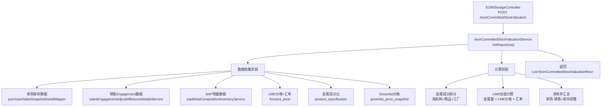

# 月底净库存估值表 — 调用链梳理

> **业务含义**：汇总采购+销售+库存多源数据，进行金属成分拆分和 LME 估值计算，生成月底净库存的估值报表。只读报表，不落库。

---

## 一、调用链路图



---

## 二、数据收集阶段（核心）

### 2.1 多源数据加载

月底净库存估值需要从多个数据源汇总：

| 数据源 | 方法/来源 | 用途 |
|--------|----------|------|
| 采购库存 | `purchaseSalesSnapshotDetailMapper` | 已定价未入库的采购量+金额 |
| 销售Engagement | `salesEngagamentAdjustdifferenceDetailsService` | 已定价未开票的销售量+金额 |
| SAP增量 | `sapMetalCompositionInventoryService` | B/C/D/E/H/F/A 类型的库存变动 |
| LME价格 | `forward_price` 表 | Cash/Lowest 结算价（前3交易日） |
| USD-EUR汇率 | `forward_price` 表 | Bloomberg USD-EUR 汇率 |
| 金属成分 | `product_specification` | Cu/Ni/Sn/Al/Zn/Pb/Yield 占比 |
| Greenlist价格 | `greenlist_price_snapshot` | 已执行的 Greenlist 快照数据 |
| 商品大类 | `product_category` | Z001/Z002/Z003 分类 |
| 工厂映射 | `abutment_config_details` | 机构ID→工厂代码 |

### 2.2 数据过滤条件

- **时间范围**：截至请求的会计月末
- **业务机构**：按 `legalEntityId` 过滤
- **业务板块**：排除 RB/RS 板块
- **合同类型**：排除短期合同（`contract_type != 'ShortTerm'`）

---

## 三、计算逻辑

### 3.1 金属成分拆分

与采购/销售快照逻辑一致：
- **原材料（Z001）**：取自身 `product_specification`
- **半成品（Z002）/成品/Alloy（Z003）**：取顶层父商品的 `product_specification`
- **工厂维度过滤**：按 `category` 匹配工厂代码

```java
yieldValue = Yield折率
yieldMutQuantity = quantity × yieldValue

for each metal (Cu/Ni/Sn/Al/Zn/Pb):
    metalKg = metalPct × yieldMutQuantity
```

### 3.2 LME 估值计算

```java
// 取前3交易日 LME 结算价（Cash 或 Lowest，取决于 family）
lmePrice = forwardPriceMap.get(curveId)
lmePriceEur = lmePrice × usdEurExchangeRate  // USD → EUR

for each metal:
    metalValueEur = metalKg × lmePriceEur
```

### 3.3 净库存汇总

```
净库存量 = 采购已定价量 - 销售已定价量 + SAP库存调整
净库存估值 = Σ(各金属 metalValueEur) + Greenlist Adder 调整
```

---

## 四、响应结构

**返回类型**：`List<EomCommittedStockValuationRes>`

**主要字段**：
- 法律实体、业务板块
- 商品信息（productId、商品名、规格、大类）
- 净库存量（kg）
- 金属成分明细（Cu/Ni/Sn/Al/Zn/Pb 的 kg 和 EUR 估值）
- LME 价格、汇率
- Greenlist 价格、Adder
- 总估值（EUR）

---

## 五、Small Hedge Val 弹窗

Controller 还提供了 Small Hedge Val 的保存和历史查询接口：

| 接口 | 方法 | 说明 |
|------|------|------|
| `POST /saveEomCommittedStockValuationSmallHedge` | `saveSmallHedge(req)` | 保存 Small Hedge Val 手工录入值 |
| `POST /listEomCommittedStockValuationSmallHedgeHistory` | `listSmallHedgeHistory(req)` | 查询 Small Hedge Val 历史记录 |

---

## 六、重要业务备注

1. **只读报表**：不落库，每次查询实时计算
2. **多源数据汇总**：采购+销售+SAP 三方数据合并
3. **与快照的关系**：计算逻辑与采购/销售快照(①②)的金属拆分一致，但本报表是实时查询而非快照落库
4. **Greenlist 依赖**：需要先执行 Greenlist 快照(⑤)才有价格数据可用
5. **Small Hedge Val**：支持手工录入小额对冲估值，与系统计算值并存
