# EOM Engagement 月底已定价未交割 — 调用链梳理

> **业务含义**：从期货 Engagement 数据中查询截至月底已定价但尚未交割的实物交易明细，并按机构/金属/合约维度汇总。包含明细报表和汇总报表两个接口。

---

## 一、调用链路图

```mermaid
flowchart TB
    subgraph 明细报表
        A1["EomEngagementReportController<br/>POST /getDetailReport"] --> B1["eomEngagementDetailService<br/>.listDetailReport(req)"]
        B1 --> C1["数据收集"]
        C1 --> D1["futuresRecordService<br/>.engagementPage(query)"]
        D1 --> E1["physical_deal_line<br/>physical_deals<br/>product"]
        B1 --> F1["返回<br/>List&lt;EomEngagementDetailReportRes&gt;"]
    end
    
    subgraph 汇总报表
        A2["EomEngagementReportController<br/>POST /getSummaryReport"] --> B2["eomEngagementSummaryService<br/>.listSummaryReport(req)"]
        B2 --> C2["数据收集"]
        C2 --> D2["futuresRecordService<br/>.engagementPage(query)"]
        D2 --> E2["physical_deal_line<br/>physical_deals<br/>product"]
        B2 --> F2["分组汇总<br/>按机构+金属+合约"]
        F2 --> G2["返回<br/>List&lt;EomEngagementSummaryReportRes&gt;"]
    end
```



---

## 二、数据收集阶段（核心）

### 2.1 主数据源：期货 Engagement 报表

**方法**：`futuresRecordService.engagementPage(query)`

**请求参数**：
```java
EngagementPageQuery query = new EngagementPageQuery();
query.setQueryDate(req.getAccountingDate());      // 会计月末日期
query.setTradingEndDay(req.getAccountingDate());  // 交易截止日 = 会计月末
query.setPromptBeginDate(req.getAccountingDate().plusDays(1));  // 交割日开始 = 会计月末次日
query.setLegalEntityId(req.getLegalEntityId());
query.setPage(1);
query.setSize(-1);  // 不分页，全量加载
```

**参数含义**：
- `queryDate`：查询基准日，筛选截至该日期仍有效的头寸
- `tradingEndDay`：交易截止日，筛选交易日 ≤ 该日期的记录
- `promptBeginDate`：提示日开始，筛选交割日 > 会计月末的记录（即"未交割"）

**数据来源表**：
- `physical_deal_line`（实物交易行）
- `physical_deals`（实物交易主表，`ps_flag` 区分采购/销售）
- `product`（商品）
- `sys_company`（业务机构）
- 关联期货合约、定价数据

**筛选条件**：
- 已定价（`priced = true`）
- 未交割（交割日 > 会计月末）
- 按机构过滤

### 2.2 辅助数据

| 数据 | 来源 | 用途 |
|------|------|------|
| 金属成分 | `product_specification` | Cu/Ni/Sn/Al/Zn/Pb 占比 |
| LME 价格 | `forward_price` | 估值计算 |
| 汇率 | `forward_price` | USD→EUR 转换 |

---

## 三、明细报表逻辑

**方法**：`eomEngagementDetailService.listDetailReport(req)`

**返回类型**：`List<EomEngagementDetailReportRes>`

**主要字段与数据来源**：

| 字段 | 来源 | 说明 |
|------|------|------|
| `legalEntityId` | `FuturesEngagementRow.legalEntityId` | 法律实体 |
| `counterpartyId` | `FuturesEngagementRow.counterpartyId` | 交易对手 |
| `contractNumber` | `FuturesEngagementRow.contractNumber` | 合同号 |
| `productId` | `FuturesEngagementRow.productId` | 商品ID |
| `productName` | `FuturesEngagementRow.productName` | 商品名称 |
| `psFlag` | `FuturesEngagementRow.psFlag` | 交易方向（P=采购, S=销售） |
| `engagementQuantity` | `FuturesEngagementRow.engagementQuantity` | 已定价未交割量（kg） |
| `pricingDate` | `FuturesEngagementRow.pricingDate` | 定价日期 |
| `deliveryDate` | `FuturesEngagementRow.deliveryDate` | 交割日期 |
| `price` | `FuturesEngagementRow.price` | 单价 |
| `amount` | `FuturesEngagementRow.amount` | 金额 |
| 金属成分明细 | `product_specification` 表 | Cu/Ni/Sn/Al/Zn/Pb 的 kg |

**金属拆分计算**：

```java
// 与采购/销售快照逻辑一致
yieldValue = Yield折率
yieldMutQuantity = engagementQuantity × yieldValue

for each metal (Cu/Ni/Sn/Al/Zn/Pb):
    metalKg = metalPct × yieldMutQuantity
```

---

## 四、汇总报表逻辑

**方法**：`eomEngagementSummaryService.listSummaryReport(req)`

**返回类型**：`List<EomEngagementSummaryReportRes>`

**分组维度**：
- 法律实体（`legalEntityId`）
- 金属类型（`specificationTypeId`，如 Cu/Ni/Sn 等）
- 合约（`contractNumber`）

**汇总字段**：
- 总数量（kg）
- 总金额（EUR）
- 各金属总量（kg）

**逻辑**：
1. 调用 `futuresRecordService.engagementPage(query)` 获取全量数据
2. 按 `legalEntityId + specificationTypeId + contractNumber` 分组
3. 每组内 SUM 数量、金额、金属量
4. 返回汇总列表

---

## 五、手工录入接口

Controller 还提供了手工录入数据的 CRUD 接口：

| 接口 | 方法 | 说明 |
|------|------|------|
| `POST /reportData/save` | `saveReportData(data)` | 新增手工录入 |
| `POST /reportData/update` | `updateReportData(data)` | 修改手工录入 |
| `POST /reportData/saveOrUpdate` | `saveOrUpdateReportData(data)` | 新增或修改 |

**用途**：对于系统无法自动计算的 Engagement 数据，支持手工录入后与系统数据合并展示。

---

## 六、重要业务备注

1. **只读报表**：不落库，每次查询实时计算
2. **与 LME 头寸快照的关系**：数据源相同（`futuresRecordService.engagementPage()`），但 LME 头寸快照(④)会落库，本报表是只读查询
3. **明细 vs 汇总**：明细报表返回逐行数据，汇总报表按机构+金属+合约分组
4. **手工录入支持**：对于特殊场景（如系统无法自动定价），支持手工录入后合并展示
5. **时间范围**：固定为"截至会计月末已定价但未交割"的记录
