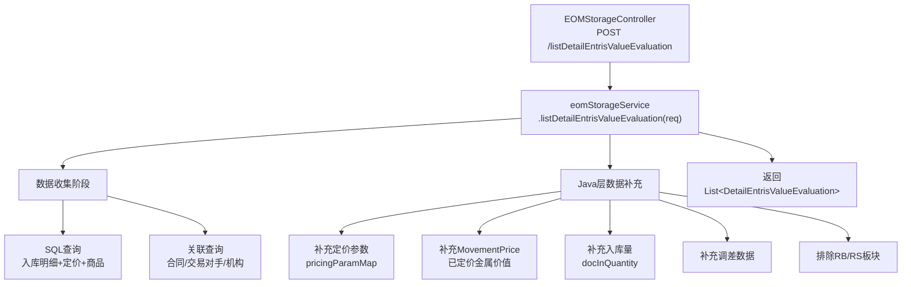
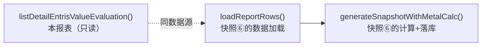

# 库存价值评估表查询 — 调用链梳理

> **业务含义**：按会计月过账区间与业务机构，查询入库明细的库存条目估值数据。这是月度入库金属价值明细快照(⑥)的**同源报表查询**，共享相同的数据加载链路。

---

## 一、调用链路图

---

## 二、数据收集阶段（核心）

### 2.1 请求参数

**类型**：`DetailEntrisValueEvaluationQuery`

| 字段 | 类型 | 说明 |
|------|------|------|
| `accountingDate` | LocalDate | 会计日期（月末） |
| `legalEntityId` | Long | 业务机构 ID |
| `businessSegmentId` | Long | 业务板块 ID |
| `yearMonth` | YearMonth | 年月 |
| `page` / `size` | Integer | 分页参数 |

### 2.2 主 SQL 查询

**Mapper**：`EomStorageMapper` 或相关 Mapper XML

**查询内容**：
- 入库明细（`document_items` + `documents`，`action_id=42` 入库动作）
- 关联实物交易行（`physical_deal_line`）
- 关联实物交易主表（`physical_deals`）
- 关联商品（`product`）
- 关联交易对手（`counterparty`）
- 关联业务机构（`sys_company`）

**关键过滤条件**：
- 过账日期在会计月区间内
- 入库状态已确认（`status IN (2,10)`, `sap_push_status=2`）
- `offset_flag='N'`（排除冲销记录）
- 排除 RB/RS 业务板块

### 2.3 Java 层数据补充

在主 SQL 返回后，Java 层补充以下数据：

| 数据 | 来源 | 用途 |
|------|------|------|
| 定价参数 `pricingParamMap` | `physical_deal_line` | 解析定价公式参数 |
| MovementPrice | `movement_price` | 逐行已定价金属价值 |
| 入库量 `docInQuantity` | `documents` mapper | 截至月份的累计入库量 |
| 调差数据 | 调差服务 | 采购/销售调差 |
| 价格触发 | `price_triggering` | 价格触发与运动价格明细 |

---

## 三、响应字段与计算公式

**返回类型**：`DetailEntrisValueEvaluation`（实体类字段）

### 3.1 数量字段

| 字段 | 注释名 | 计算公式 | 说明 |
|------|--------|---------|------|
| `grQuantity` | 入库登记数量 (GR Quantity) | 从 `document_items` 表读取 | 入库登记时的原始数量 |
| `offsetGrQuantity` | 入库登记冲销数量 (Offset GR Quantity) | 从 `document_items` 表读取 | 冲销记录的数量 |
| `receivedQuantity` | 已入库数量 (Received Quantity) | `grQuantity - offsetGrQuantity` | 实际入库量（报表展示列 R） |
| `invoicedQuantity` | 已开票数量 (Invoiced Quantity) | 从 `movement_price` 表汇总 | 已开票的数量 |
| `uninvoicedQuantity` | 待开票数量 (Uninvoiced Quantity) | `receivedQuantity - invoicedQuantity` | 未开票的数量 |
| `linkedQuantity` | 关联数量 (Linked Quantity) | 从定价参数解析 | 已关联均价的数量 |
| `unlinkedQuantity` | 未关联数量 (Unlinked Quantity) | `receivedQuantity - linkedQuantity` | 未关联均价的数量 |

### 3.2 价格字段

| 字段 | 注释名 | 计算公式 | 说明 |
|------|--------|---------|------|
| `linkedPrice` | 已关联均价 (Linked Price, /kg) | 从 `movement_price` 表计算 | 已定价部分的均价 |
| `unlinkedPrice` | 未关联均价 (Unlinked Price, /kg) | 从 `movement_price` 表计算 | 未定价部分的均价 |
| `accountingTotalValue` | 记账金额 (Accounting Total Value) | `linkedQuantity × linkedPrice + unlinkedQuantity × unlinkedPrice` | 结算币种的总金额 |
| `addedValue` | 附加价 (Added Value) | 从定价参数解析 | 附加价值 |
| `metalValue` | 金属价 (Metal Value) | 从 `movement_price` 表汇总 | 金属部分的价值 |
| `taxIncInvoiceAmount` | 开票金额 (Tax inc Invoice Amount) | 从发票数据汇总 | 含税发票金额 |
| `linkedPendingCdAmount` | 关联部分待收 credit/debit 金额 | 从调差数据计算 | 关联部分的待收金额 |
| `unlinkedPendingCdAmount` | 未关联部分待收 credit/debit 金额 | 从调差数据计算 | 未关联部分的待收金额 |
| `totalPendingCdAmount` | 待收 credit/debit 金额 | `linkedPendingCdAmount + unlinkedPendingCdAmount` | 总待收金额 |

### 3.3 本位币字段（Base Currency）

所有上述金额字段都有对应的本位币版本，通过汇率转换：

| 字段 | 计算公式 |
|------|---------|
| `accountingTotalValueBaseCurrency` | `accountingTotalValue ÷ forex` |
| `addedValueBaseCurrency` | `addedValue ÷ forex` |
| `metalValueBaseCurrency` | `metalValue ÷ forex` |
| `taxIncInvoiceAmountBaseCurrency` | `taxIncInvoiceAmount ÷ forex` |
| `totalPendingCdAmountBaseCurrency` | `totalPendingCdAmount ÷ forex` |

**汇率取值**：从 `forward_price` 表查询 Bloomberg 发布的结算价汇率。

### 3.4 金属计算相关字段（快照⑥计算后填充）

| 字段 | 注释名 | 计算公式 | 说明 |
|------|--------|---------|------|
| `netWeightKg` | 净重 (kg) | `receivedQuantity × yieldRatio` | 已入库数量 × Yield 折率 |
| `metalloEur` | 金属价值合计 (EUR) | `baseCurMetalValue + baseCurReceivableCDAmount` | 金属总价值（本位币） |
| `compositionTot` | 质检组成求和 (tot) | `Σ(各金属含量)` | 所有金属含量之和（应接近 100%） |
| `greenListEurPerKg` | Green List (Eur/kg) | 从 Greenlist 快照查询 | Greenlist 单价（EUR/KG） |
| `lmeWithYieldEurPerKg` | LME Equivalent (Eur/kg) | 从 Greenlist 快照查询 | LME 等价单价（EUR/KG） |
| `unitAdder` | Unit Adder (Eur/kg) | `Greenlist Adder ÷ 1000` | 单位 Adder（EUR/KG） |
| `weightRef` | 主成分考虑数量 (Weight Ref) | 主成分的金属量 | 含量最高的金属的 KG 量 |
| `totalAdder` | Total ADDER | `unitAdder × weightRef` | 总 Adder（EUR） |
| `unitMargin` | Margin 手工加价 | 从 ForwardPrice 查询 | 单位 Margin（EUR/KG） |
| `totalMargin` | Margin 手工加价 | `unitMargin × netWeightKg` | 总 Margin（EUR） |
| `chk` | 检查 (CHK) | `compositionTot ≈ 100% ? "OK" : "ERR"` | 成分校验 |
| `metalRef` | 主成分 (Ref) | 含量最高的金属 | 如 "CU", "NI" 等 |

### 3.5 金属子表字段（EvaluationOfDetaileEntriesValueSnapshotDetail）

| 字段 | 注释名 | 计算公式 | 说明 |
|------|--------|---------|------|
| `specificationTypeId` | 质检类型ID | 从 `product_specification` 表查询 | 金属类型 ID |
| `metalType` | 金属类型 | 从 `specification_type` 表查询 | 如 "CU", "NI", "SN" 等 |
| `content` | 含量 | 从 `product_specification` 表查询 | 金属含量占比（%） |
| `quantityKg` | 数量 (kg) | `netWeightKg × content` | 该金属的 KG 量 |
| `priceEurPerKg` | 价格 (Eur/kg) | 从 LME/ForwardPrice 查询 | 该金属的 EUR/KG 价格 |
| `metalValueEur` | 金属价值 (欧元) | `quantityKg × priceEurPerKg` | 该金属的 EUR 估值 |
| `finalWeightPmp` | Final weight PMP | 从计算结果获取 | PMP 最终重量 |
| `nonMainComponentAmount` | 非主成分金额 | 从价值分配算法计算 | 非主成分的金额 |
| `consideredKgs` | 考虑 kgs | 从计算结果获取 | 参与计算的 KG 量 |
| `finalWeight` | 最终重量 | 从计算结果获取 | 最终重量 |
| `unitValue` | 单位价值 | `metalValueEur ÷ quantityKg` | 单位价值（EUR/KG） |
| `totalValue` | 总价值 | `metalValueEur` | 总价值（EUR） |

---

## 四、与快照的关系

- 本报表 `listDetailEntrisValueEvaluation()` 是**只读查询**
- 快照⑥ `generateSnapshotWithMetalCalc()` 内部调用 `loadReportRows()` → 同样调用 `eomStorageService.listDetailEntrisValueEvaluation()` 获取数据
- 两者共享**完全相同的数据加载链路**（参见 `EvaluationOfDetaileEntriesValueSnapshotServiceImpl.loadReportRows()` L247-255）

---

## 五、重要业务备注

1. **只读报表**：不落库，直接返回查询结果
2. **与快照⑥同源**：月度入库金属价值明细快照的数据来源就是本报表
3. **快照时的额外处理**：快照⑥在本报表数据基础上，还会调用 `snapshotAssembler.prepareReportQuery()` 预处理查询参数，并通过 `buildMainSnapshots()` + `enrichBatch()` 做金属拆分计算
4. **分页支持**：报表查询支持分页（`page`/`size`），快照计算时 `size=-1` 全量加载
5. **RB/RS 板块排除**：与采购/销售快照一致
