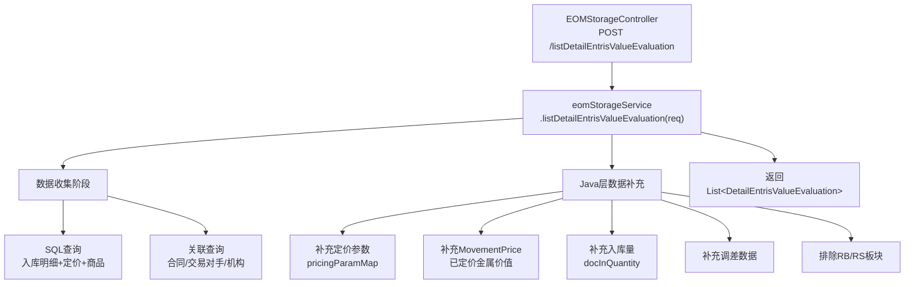
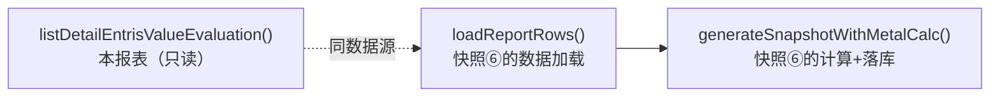

# 库存价值评估表查询 — 调用链梳理

> **业务含义**：按会计月过账区间与业务机构，查询入库明细的库存条目估值数据。这是月度入库金属价值明细快照(⑥)的**同源报表查询**，共享相同的数据加载链路。

---

## 一、调用链路图

---

## 二、数据收集阶段（核心）

### 2.1 请求参数

**类型**：`DetailEntrisValueEvaluationQuery`

| 字段 | 类型 | 说明 |
|------|------|------|
| `accountingDate` | LocalDate | 会计日期（月末） |
| `legalEntityId` | Long | 业务机构 ID |
| `businessSegmentId` | Long | 业务板块 ID |
| `yearMonth` | YearMonth | 年月 |
| `page` / `size` | Integer | 分页参数 |

### 2.2 主 SQL 查询

**Mapper**：`EomStorageMapper` 或相关 Mapper XML

**查询内容**：
- 入库明细（`document_items` + `documents`，`action_id=42` 入库动作）
- 关联实物交易行（`physical_deal_line`）
- 关联实物交易主表（`physical_deals`）
- 关联商品（`product`）
- 关联交易对手（`counterparty`）
- 关联业务机构（`sys_company`）

**关键过滤条件**：
- 过账日期在会计月区间内
- 入库状态已确认（`status IN (2,10)`, `sap_push_status=2`）
- `offset_flag='N'`（排除冲销记录）
- 排除 RB/RS 业务板块

### 2.3 Java 层数据补充

在主 SQL 返回后，Java 层补充以下数据：

| 数据 | 来源 | 用途 |
|------|------|------|
| 定价参数 `pricingParamMap` | `physical_deal_line` | 解析定价公式参数 |
| MovementPrice | `movement_price` | 逐行已定价金属价值 |
| 入库量 `docInQuantity` | `documents` mapper | 截至月份的累计入库量 |
| 调差数据 | 调差服务 | 采购/销售调差 |
| 价格触发 | `price_triggering` | 价格触发与运动价格明细 |

---

## 三、响应结构

**返回类型**：`List<DetailEntrisValueEvaluation>`

**主要字段**：
- 法律实体、业务板块
- 商品信息（productId、商品名、规格）
- 入库数量（kg）
- 定价金额（结算币/本位币）
- 交易对手、合同号
- 物理交易行 ID（`physicalDealLineId`）
- 过账日期

---

## 四、与快照的关系

- 本报表 `listDetailEntrisValueEvaluation()` 是**只读查询**
- 快照⑥ `generateSnapshotWithMetalCalc()` 内部调用 `loadReportRows()` → 同样调用 `eomStorageService.listDetailEntrisValueEvaluation()` 获取数据
- 两者共享**完全相同的数据加载链路**（参见 `EvaluationOfDetaileEntriesValueSnapshotServiceImpl.loadReportRows()` L247-255）

---

## 五、重要业务备注

1. **只读报表**：不落库，直接返回查询结果
2. **与快照⑥同源**：月度入库金属价值明细快照的数据来源就是本报表
3. **快照时的额外处理**：快照⑥在本报表数据基础上，还会调用 `snapshotAssembler.prepareReportQuery()` 预处理查询参数，并通过 `buildMainSnapshots()` + `enrichBatch()` 做金属拆分计算
4. **分页支持**：报表查询支持分页（`page`/`size`），快照计算时 `size=-1` 全量加载
5. **RB/RS 板块排除**：与采购/销售快照一致
