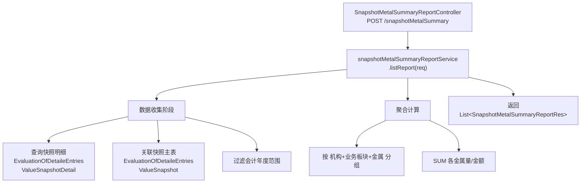

# 年度库存金属成本汇总表（EOM PMP Summary）— 调用链梳理

> **业务含义**：从已生成的月度入库金属价值明细快照(⑥)中聚合数据，按"机构 + 业务板块 + 金属"维度汇总年度金属成本。是快照数据的二次聚合报表。

---

## 一、调用链路图

---

## 二、数据收集阶段（核心）

### 2.1 请求参数

**类型**：`SnapshotMetalSummaryReportReq`

| 字段 | 类型 | 说明 |
|------|------|------|
| `year` | Integer | 查询年度 |
| `legalEntityId` | Long | 业务机构 ID（可选） |
| `businessSegmentId` | Long | 业务板块 ID（可选） |

### 2.2 数据来源

**核心数据源**：月度入库金属价值明细快照(⑥)的落库数据

| 表 | 说明 |
|----|------|
| `evaluation_of_detaile_entries_value_snapshot` | 快照主表（含会计日期、机构、板块） |
| `evaluation_of_detaile_entries_value_snapshot_detail` | 快照明细（含各金属量和估值） |

**查询逻辑**：
1. 按年度过滤：快照主表的 `accounting_date` 在指定年度范围内（1月~12月）
2. 可选按机构/板块过滤
3. JOIN 主表和明细表，获取各金属的量价数据

### 2.3 与其他报表的区别

| 对比项 | 本报表（⑩） | 库存价值评估表（⑨） |
|--------|------------|-------------------|
| 数据来源 | 快照落库数据（已计算） | 实时查询原始数据 |
| 聚合维度 | 机构+板块+金属 | 逐行明细 |
| 时间范围 | 年度汇总 | 单月查询 |
| 是否实时计算 | 否（读取已有快照） | 是 |

---

## 三、聚合计算逻辑

### 3.1 分组维度

按以下三个维度分组：
1. **法律实体**（`legalEntityId`）
2. **业务板块**（`businessSegmentId`）
3. **金属类型**（`specificationTypeId` → Cu/Ni/Sn/Al/Zn/Pb）

### 3.2 汇总字段

每组 SUM 以下数据：
- 各金属数量（kg）
- 各金属估值金额（EUR）
- 净重（kg）
- 总 Adder（EUR）
- 总 Margin（EUR）

---

## 四、响应结构

**返回类型**：`List<SnapshotMetalSummaryReportRes>`

**主要字段**：
- 法律实体 ID + 名称
- 业务板块 ID + 名称
- 金属类型（Cu/Ni/Sn/Al/Zn/Pb）
- 年度累计金属量（kg）
- 年度累计估值（EUR）
- 年度累计 Adder（EUR）

---

## 五、重要业务备注

1. **依赖快照⑥**：本报表读取的是月度入库金属价值明细快照(⑥)的落库数据，必须先执行快照计算才有数据
2. **只读报表**：不落库，直接聚合查询返回
3. **年度维度**：按会计年度汇总12个月的快照数据
4. **二次聚合**：快照⑥已经做了金属拆分计算，本报表只是在此基础上做更粗粒度的汇总
5. **EOM PMP Summary**：即 "End of Month Physical Metal Position Summary"，年度库存金属头寸汇总
