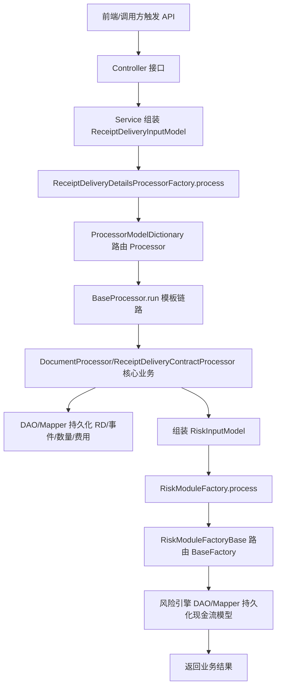

# ReceiptDeliveryDetailsProcessorFactory.process 调用链深度分析

## 一、总调用图（先给全局）

> [!info] 调用概览
> 以下流程图展示了从接口入口到数据持久化的完整调用链路

> 说明：`RiskModuleFactoryBase` 内部工厂调用较深，DAO/SQL 细节基于代码调用语义推导。

## 二、入口定位（接口层）

- API：`POST /api/receiptDelivery/init`
- Controller：`ReceiptDeliveryController`
- 方法：`updateReceiptDelivery(...)`
- 入口动作：调用 `receiptDeliveryInitModelService.intiByPhysicalDealId(...)` 构造输入模型，再调用 `receiptDeliveryDetailsProcessorFactory.process(inputModel)`

补充入口（同一处理链）：

- `DealController` 多个合同新增/修改流程也会调用 `receiptDeliveryDetailsProcessorFactory.process(inputModel)`。
- `PhysicalDealsServiceImpl`、`DocumentsServiceImpl`、`FundPathServiceImpl` 等业务流程会复用该入口。

## 三、执行链路总览（按调用层级）

- 1) `Controller` 接收请求并触发 `Service`
- 2) `Service` 组装 `ReceiptDeliveryInputModel`（含 `headerType/dataStatus/model`）
- 3) `ReceiptDeliveryDetailsProcessorFactory.process` 执行总编排
- 4) `ProcessorModelDictionary` 根据 `headerType` 路由到 `DocumentProcessor` 或 `ReceiptDeliveryContractProcessor`
- 5) `BaseProcessor.run` 按固定模板执行“初始化 -> 拆分/生成 -> 回写明细附属数据”
- 6) 各 `Processor/Handler` 调用 DAO/Mapper 落库（`receipt_delivery_details` 相关主从表及费用表）
- 7) 组装 `RiskInputModel` 并进入 `RiskModuleFactory`
- 8) `RiskModuleFactoryBase` 按 `modelCategory` 选择风险工厂，落库现金流模型

## 四、分层调用链深度解析（逐方法+子方法）

### 4.1 接口入口层（Controller/Rest）

#### 4.1.1 `ReceiptDeliveryController.updateReceiptDelivery`

- 作用：按合同号触发收发货明细重算。
- 上下游关系：
  - 上游：HTTP 请求 `/api/receiptDelivery/init`
  - 下游：`receiptDeliveryInitModelService`、`receiptDeliveryDetailsProcessorFactory`
- 子方法/内部调用：
  - 4.1.1.1 `physicalDealsService.select(...)`
    - 作用：按合同号查询合同主数据。
    - 与父方法关系：提供后续初始化所需 `physicalDealId`。
  - 4.1.1.2 `receiptDeliveryInitModelService.intiByPhysicalDealId(...)`
    - 作用：构建 `ReceiptDeliveryInputModel`。
    - 与父方法关系：生成 `process` 的直接入参。
  - 4.1.1.3 `receiptDeliveryDetailsProcessorFactory.process(...)`
    - 作用：执行完整物资明细+现金流链路。
    - 与父方法关系：核心业务落点。

### 4.2 业务实现层（Service）

#### 4.2.1 `ReceiptDeliveryDetailsProcessorFactory.process`

- 业务目标：串行完成一次收发货明细重算，并触发现金流模型更新。
- 关键步骤：
  - 使用类级 `synchronized` 防并发；
  - 初始化 `RdContext` 并注入 `processorInput`；
  - 按 `headerType` 选择处理器并执行 `run(context)`；
  - 将 `rdListForGenerateModel` 映射为 `RiskInputDetailModel`；
  - 调用 `_riskModuleFactory.process(riskInputModel)`。
- 关键上下文：
  - `headerType`：决定 Processor 分支和风险模型类型；
  - `dataStatus`：决定删除/修改时数量处理；
  - `rdListForGenerateModel`：风险模型输入来源。
- 上下游关系：
  - 上游：Controller/Service 触发
  - 下游：`ProcessorModelDictionary`、`RiskUtil`、`RiskModuleFactory`
- 子方法/内部调用：
  - 4.2.1.1 `ProcessorModelDictionary.processorItems.get(...).run(context)`
    - 业务动作：进入物资明细主处理模板。
    - 与父方法关系：完成主业务数据重算。
  - 4.2.1.2 `RiskUtil.calculateModelCategory(...)`
    - 业务动作：把 `headerType` 映射为风险引擎类别。
    - 与父方法关系：决定现金流工厂路由。
  - 4.2.1.3 `RiskModuleFactory.process(...)`
    - 业务动作：触发现金流模型重算与持久化。
    - 与父方法关系：完成第二段业务目标。

#### 4.2.2 `BaseProcessor.run`（模板方法）

- 业务目标：统一各种模型（合同/单据）的执行阶段顺序。
- 关键步骤：
  - `preCheckTask -> commonInit -> extentInit`
  - `calculateQuantityByDataState -> unitConvert`
  - `process -> processLeft/processRight`
  - `processEvents/processSpecifications/processQuantities/processCharges`
  - `revalueBaseQuantities`
- 关键上下文：`RdContext` 中的 `originalRDList`、`rdListForCalculateDetails`、`rdListForGenerateModel`。
- 上下游关系：
  - 上游：`ReceiptDeliveryDetailsProcessorFactory.process`
  - 下游：具体子类 Processor 与 HandlerUtils。
- 子方法/内部调用：
  - 4.2.2.1 `DocumentProcessor.process(...)`
    - 业务动作：按 `actionId + rdFlag` 分派 handler，做拆分与冲销。
    - 与父方法关系：单据模式核心落点。
  - 4.2.2.2 `ReceiptDeliveryContractProcessor.processRight(...)`
    - 业务动作：合同行生成/更新 BAV 与非 BAV RD。
    - 与父方法关系：合同模式核心落点。

#### 4.2.3 `DocumentProcessor.process`（多模型 mode 处理）

- 业务目标：处理单据类 headerType 的复杂场景（入库、出库、拣配、移库、仓单等）。
- 关键步骤：
  - 查询 `DocumentActionItems`；
  - 按每行 `rdFlag` 找到对应 action；
  - 执行 `handler.syncFields().execute().clearSyncConsumer()`；
  - 后续阶段统一重建 events/specifications/quantities/charges。
- 关键上下文：
  - `actionId`、`rdFlag`
  - `context.originalRDList`
  - `documentContext`（actions/items/documents）
- 上下游关系：
  - 上游：`BaseProcessor.run`
  - 下游：`BaseHandler` 各实现及 `HandlerUtils`
- 子方法/内部调用（核心）：
  - 4.2.3.1 `InitialDocumentHandler.execute`
    - 业务动作：移库入库/初始库存生成当前单据 RD。
    - 与父方法关系：处理初始类入库场景。
  - 4.2.3.2 `SplitContractOrDocumentHandler.execute`
    - 业务动作：入库通知场景拆分上游并回算合同匹配量。
    - 与父方法关系：处理入库通知类场景。
  - 4.2.3.3 `SplitDocumentInDistributionHandler.execute`
    - 业务动作：出库计划/通知/登记及拣配分支处理。
    - 与父方法关系：出库分发核心。
  - 4.2.3.4 `SplitDocumentOnTwHandler.execute`
    - 业务动作：库存调差/预拣配/移库出库/仓单质押解押处理。
    - 与父方法关系：仓单与库存特殊场景处理。
  - 4.2.3.5 `SplitDocumentWithoutGenerateContractHandler.execute`
    - 业务动作：入库登记场景链路（生成当前 RD + 拆上游 + 回算）。
    - 与父方法关系：无新合同生成的入库链路。
  - 4.2.3.6 `SplitContractSoAndPoHandler.execute`
    - 业务动作：工厂直发场景同单拆分销售/采购合同量。
    - 与父方法关系：双合同拆分特例。

#### 4.2.4 `HandlerUtils`（应用编排层核心）

- 业务目标：封装 RD 生成、拆量、回算与删除回滚。
- 关键步骤（典型）：
  - `generateCurrentDocumentRD`
  - `splitParentDocument`
  - `splitParentDistributionDocument`
  - `revalueMatchedContractRd*`
  - `generateDistributionRds`
  - `handleDistributionDelete`
- 关键上下文：
  - `ReceiptDeliveryStatus`、`ReceiptDeliveryTypes`
  - `matchNumber`、`BAV`、`storageStatisticsType`
  - `receiptDeliverySummaryList`
- 上下游关系：
  - 上游：各 Handler.execute
  - 下游：`ReceiptDeliveryDetailsMapper`、`ReceiptDeliverySummaryMapper` 等 DAO。

#### 4.2.5 `RiskModuleFactoryBase.process`

- 业务目标：将 `RiskInputModel` 路由到对应风险工厂并执行现金流引擎。
- 关键步骤：
  - `formatInputModel` 转换为 `RiskProcessContext`；
  - 按 `modelCategory` 在 `_factoryMap` 查找 `BaseFactory`；
  - 未命中时走 Bean 名称与 `DocumentActions.actionType` 兜底；
  - 调用 `baseFactory.processRiskEngines(context, null)`。
- 关键上下文：
  - `riskInputModel.modelCategory`
  - `sourceRiskModels`（headerId/physicalDealId/lineNumber/linkId/receiptDeliveryId）
- 上下游关系：
  - 上游：`ReceiptDeliveryDetailsProcessorFactory.process`
  - 下游：各风险工厂 + 风险 DAO/Mapper。

### 4.3 数据访问层（DAO/Mapper）

#### 4.3.1 收发货主数据 Mapper

- 数据动作（查/增/改/删）：
  - `ReceiptDeliveryDetailsMapper.select/insert/update`
  - `ReceiptDeliverySummaryMapper.insert/update/delete`
- 对应实体/表：
  - `ReceiptDeliveryDetails`（收发货明细主表）
  - `ReceiptDeliverySummary`（总量库存映射/汇总表）
- 与上层 Service 关系：
  - 由 `HandlerUtils`、`DocumentProcessor`、`ReceiptDeliveryContractProcessor` 直接驱动。
- 子方法/内部调用：
  - 4.3.1.1 `generateCurrentDocumentRD/splitParentDocument`
    - SQL/映射动作：RD upsert 与库存汇总关系维护。
    - 与父方法关系：核心落库点。

#### 4.3.2 明细附属数据 Mapper

- 数据动作（查/增/改/删）：
  - `ReceiptDeliveryEventsMapper.delete/insert`
  - `ReceiptDeliveryQuantitiesMapper.delete/insert`
  - `ReceiptDeliverySpecificationsMapper.delete/insert`
  - `ChargeMapper.select/insert/update/delete`
- 对应实体/表：
  - 事件表、数量表、规格表、费用表（业务主线均为 RD 从表）
- 与上层 Service 关系：
  - 由 `DocumentProcessor/DealProcessor` 后置阶段统一重建。
- 子方法/内部调用：
  - 4.3.2.1 `processEvents/processQuantities/processSpecifications/processCharges`
    - SQL/映射动作：先删后插或对比更新。
    - 与父方法关系：保证从表与主表状态一致。

#### 4.3.3 现金流模型 Mapper（风险侧）

- 数据动作（查/增/改/删）：
  - `CashflowModelHeaderValuesMapper` 查询/更新
  - `CashflowModelValuesMapper` 查询/更新
  - 风险相关查询 Mapper（如 `RiskMapper`）
- 对应实体/表：
  - `cashflow_model_header_values`
  - `cashflow_model_values`
  - 风险扩展关联表（按具体工厂分支）
- 与上层 Service 关系：
  - 由 `RiskModuleFactoryBase -> BaseFactory.processRiskEngines` 驱动。
- 子方法/内部调用：
  - 4.3.3.1 `RiskModuleFactoryBase.process`
    - SQL/映射动作：根据类别进入对应工厂并执行模型落库。
    - 与父方法关系：现金流阶段主落点。

### 4.4 应用编排层（Facade/Manager/Delegate，可选）

#### 4.4.1 `ProcessorModelDictionary` + `Handler` 体系

- 作用：把复杂业务场景拆成“headerType 路由 + action/rdFlag 路由”两级编排。
- 上下游关系：
  - 上游：`ReceiptDeliveryDetailsProcessorFactory`、`DocumentProcessor`
  - 下游：`HandlerUtils` 与 DAO。
- 子方法/内部调用：
  - 4.4.1.1 `processorItems.get(headerType)`
    - 作用：确定顶层 Processor。
    - 与父方法关系：第一层路由。
  - 4.4.1.2 `_handlerMaps.get(action).execute(...)`
    - 作用：确定单据 mode 的具体处理策略。
    - 与父方法关系：第二层路由。

## 五、核心业务方法清单（排除工具方法）

- `ReceiptDeliveryDetailsProcessorFactory.process`：总编排入口，串行执行明细与现金流。
- `DocumentProcessor.process`：单据模式核心分发器，处理多 action/mode。
- `ReceiptDeliveryContractProcessor.processRight`：合同模式核心，生成/回算 BAV。
- `HandlerUtils.generateCurrentDocumentRD`：生成当前单据 RD 与库存映射维护。
- `HandlerUtils.splitParentDocument`：消耗上游单据/合同并更新基准 RD。
- `HandlerUtils.splitParentDistributionDocument`：拣配/分发场景拆分上游单据。
- `HandlerUtils.revalueMatchedContractRd*`：合同匹配量回算。
- `HandlerUtils.generateDistributionRds`：拣配场景批量生成拆分 RD。
- `HandlerUtils.handleDistributionDelete`：拣配删除后的回滚与库存恢复。
- `RiskModuleFactoryBase.process`：风险模型路由与现金流引擎落库。

## 六、结论（当前真实流程）

> [!summary] 核心结论
> - 当前真实流程是”Controller 触发 -> Service 组装 -> Processor/Handler 落 RD 业务数据 -> RiskFactory 落现金流数据”
> - `Document` 类型复杂度最高，核心复杂点在 `actionId + rdFlag` 双维分发与库存总量控制分支
> - `process` 方法虽然代码短，但它是整个收发货与现金流两阶段编排的总入口，业务副作用覆盖主从表与风险模型表

## 七、补充说明（建议优化流程，非当前真实代码）

> [!tip] 优化建议
> - 建议补充一张”`actionId` 到 Handler 到表更新清单”的静态矩阵，便于排障
> - 建议把 `HandlerUtils` 中”总量库存/批次库存”分支逻辑拆小，降低单方法复杂度

