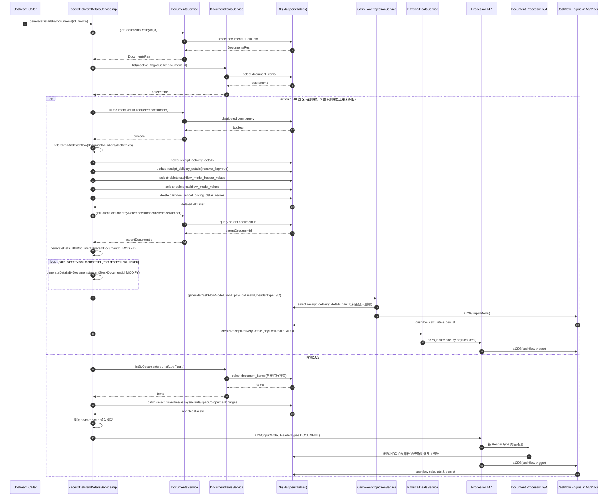

# generateDetailsByDocuments 时序图与表级影响清单

## 1. 方法范围

> [!info] 分析目标
> - **方法**：`ReceiptDeliveryDetailsServiceImpl.generateDetailsByDocuments(Long id, Integer modify)`
> - **关注点**：
>   - 删除分支（`actionId=40` 且存在删除行/整单删除）
>   - 常规分支（构建模型后进入 `b47` 引擎）
>   - 现金流联动（`cashFlowProjectionService`、`a155/a156`）

---

## 2. 时序图（Mermaid）

> 说明：以下时序图覆盖主干调用链，重点体现删除重建路径与常规生成路径的数据流。

---

## 3. 表级影响清单（读/写/删）

> 说明：以下基于该方法主链及其直接调用方法（`deleteRddAndCashflow`、`generateCashFlowModel`、`b47/b34`）归纳。  
> 其中“写”包含 `insert/update`；“删”包含逻辑删除与物理删除。

## 3.1 直接高确定性影响（当前方法及直接调用可明确看到）

| 表名 | 读取(Read) | 写入/更新(Write) | 删除(Delete) | 触发位置 |
|---|---|---|---|---|
| `documents` | 是 | 否 | 否 | `getDocumentsResById` |
| `document_items` | 是 | 否 | 否 | 删除行查询、常规取数 |
| `receipt_delivery_details` | 是 | 是（逻辑删：`inactive_flag=true`） | 否（物理删未见） | `deleteRddAndCashflow` |
| `cashflow_model_header_values` | 是 | 否 | 是（物理删） | `deleteRddAndCashflow` |
| `cashflow_model_values` | 是 | 否 | 是（物理删） | `deleteRddAndCashflow` |
| `cashflow_model_pricing_detail_values` | 否 | 否 | 是（物理删） | `deleteRddAndCashflow` |
| `document_quantities` | 是 | 否 | 否 | 常规分支数据准备 |
| `document_assays` | 是 | 否 | 否 | 常规分支数据准备 |
| `document_events` | 是 | 否 | 否 | 常规分支数据准备 |
| `document_specifications` | 是 | 否 | 否 | 常规分支数据准备 |
| `document_properties` | 是 | 否 | 否 | 常规分支数据准备 |
| `product_properties` | 是 | 否 | 否 | 属性码映射 |
| `charge` | 是 | 否（此方法内） | 否（此方法内） | 费用装配 |

---

## 3.2 引擎联动影响（通过 `b47 -> b34` / `a155` 间接影响）

### A) 收发货处理引擎（`b47 -> b34`）可确定的表操作

| 表名 | 读取(Read) | 写入/更新(Write) | 删除(Delete) | 说明 |
|---|---|---|---|---|
| `receipt_delivery_details` | 是 | 是 | 可能（按处理策略） | 主明细重算核心表 |
| `receipt_delivery_events` | 是 | 是（insert） | 是（按 receiptDeliveryId 清理） | `b34.a419` |
| `receipt_delivery_quantities` | 是 | 是（insert） | 是 | `b34.a418` / `b34.a422` |
| `receipt_delivery_specifications` | 是 | 是（insert） | 是 | `b34.a420` |
| `charge` | 是 | 是（insert/update） | 是 | `b34.a421` 将 document 费用映射到 receiptDelivery 费用 |
| `document_items` | 是 | 可能（转换后回写取决于分支） | 否 | 处理器上下文依赖 |

### B) 现金流引擎（`cashFlowProjectionService.generateCashFlowModel` + `a155.a1208`）

| 表名 | 读取(Read) | 写入/更新(Write) | 删除(Delete) | 说明 |
|---|---|---|---|---|
| `receipt_delivery_details` | 是 | 否 | 否 | 取 bav=Y、未匹配、未删除数据作为输入 |
| `physical_deals` | 是 | 否 | 否 | 无明细时兜底检查合同 |
| `cashflow_*`（模型相关表） | 是 | 是 | 可能 | 由具体策略计算器落库，类别由 `modelCategory` 决定 |

> 备注：`a155/a156` 通过策略分发到不同计算器 Bean，具体会触达哪些 `cashflow_*` 细分表，取决于 `headerType/modelCategory` 与策略实现。

---

## 4. 数据一致性与排查建议（表级）

> [!tip] 排查指南
> **删除分支**出现”收发货已删但现金流未重建”时，优先核查：
> - `receipt_delivery_details.inactive_flag`
> - `cashflow_model_header_values / cashflow_model_values / cashflow_model_pricing_detail_values`
> - `physical_deal_id` 与 `SO` 维度是否一致
>
> **常规分支**出现”主明细更新了但子表未同步”时，检查：
> - `receipt_delivery_events / receipt_delivery_quantities / receipt_delivery_specifications`
> - `b34` 对应步骤是否执行到（可通过日志关键字或断点）
>
> **费用映射异常**时，重点对比：
> - `charge.charge_type=document` 与 `charge_type=receiptDeliveryDetail`
> - `charge_level=ReceiptDelivery`

---

## 5. 附：快速核对 SQL 维度

> [!note] SQL 核对维度
> | 维度 | 关键字段 |
> | :---: | :--- |
> | 按单据核查 | `document_id`、`document_number`、`reference_number` |
> | 按明细核查 | `header_id`（document item id）、`receipt_delivery_id` |
> | 按合同核查 | `physical_deal_id`、`link_id` |
> | 按现金流核查 | `cashflow_model_header_value_id`、`cashflow_model_value_id` |

