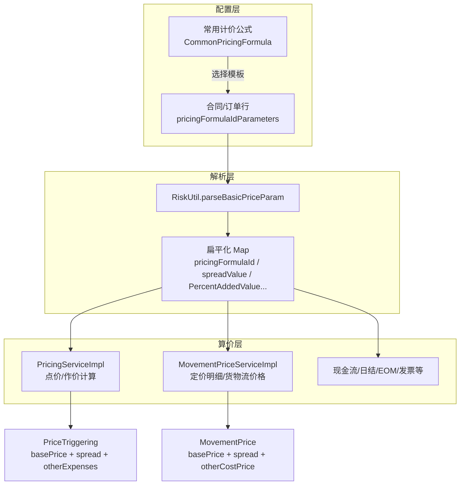
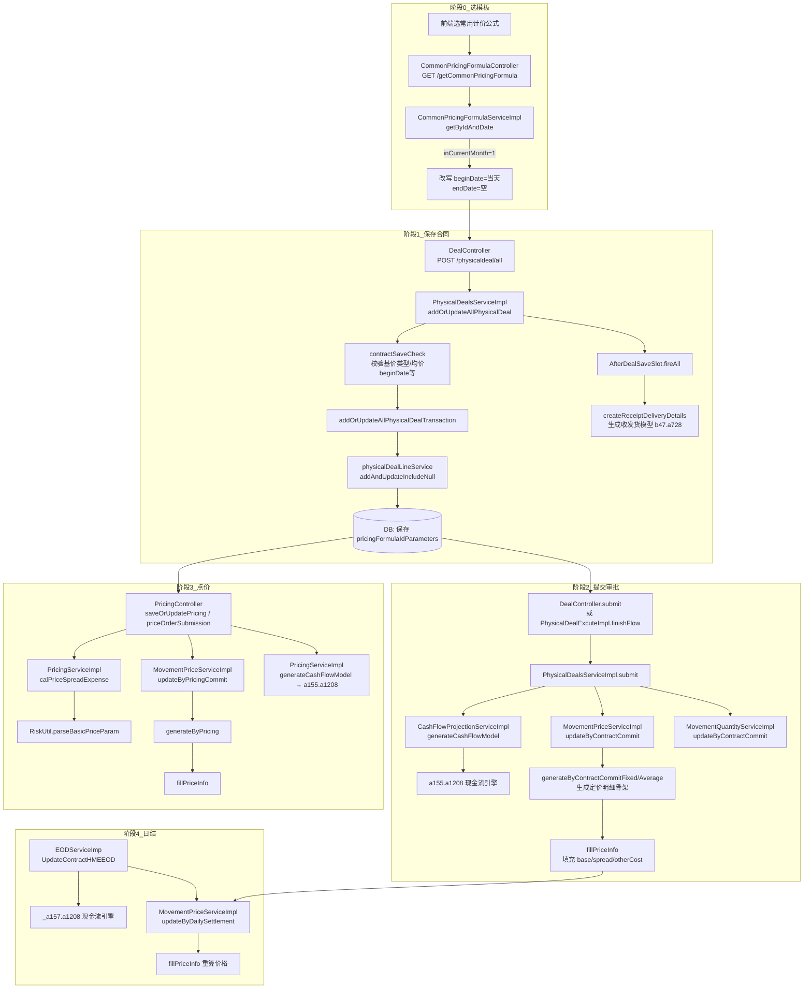
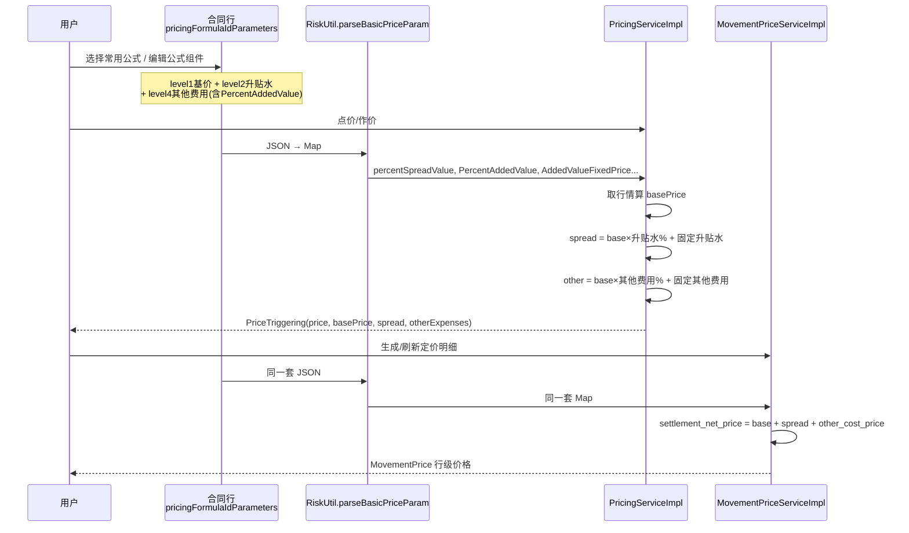
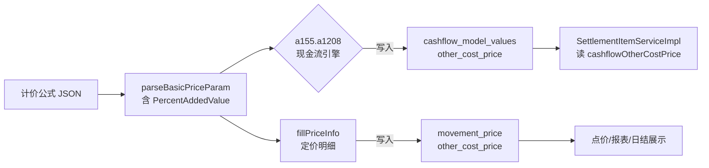

# 计价公式变更与算价链路分析

> 基于 xiang.zheng 2026/3 ~ 2026/6 相关提交整理，作为理解「计价公式 → 后续单据算价」的切面文档。

---

## 目录

1. [计价公式在系统中的角色](#1-计价公式在系统中的角色)
2. [提交变更时间线与逻辑](#2-提交变更时间线与逻辑)
3. [合同保存 → 定价明细：完整调用链](#3-合同保存--定价明细完整调用链)
4. [PercentAddedValue 覆盖核查](#4-percentaddedvalue-覆盖核查)
5. [结论与验证建议](#5-结论与验证建议)

---

## 1. 计价公式在系统中的角色

### 1.1 数据结构

计价公式以 **JSON 数组** 形式保存在合同行/订单行的 `pricing_formula_id_parameters` 字段，按 `level` 分层：

| level | 含义     | 典型 abbreviation                                      |
|-------|----------|--------------------------------------------------------|
| 1     | 基价     | `BasicTriggeredPrice`、`BasicFixedPrice`、`BasicAveragePrice` 等 |
| 2     | 升贴水   | `BasicFixedPremium`（固定/旧式百分比）、`PercentPremium`（新式百分比） |
| 3     | 加工费   | `ProcessingFee`                                        |
| 4     | 其他费用 | `AddedValue`（固定金额）、`PercentAddedValue`（百分比，2026/6 新增） |

### 1.2 核心算价公式

贯穿全系统：

```
结算净价 = 基价(basePrice) + 升贴水(spread) + 其他费用(otherCost / otherExpenses)
```

### 1.3 全局数据流



**关键入口**：几乎所有下游算价都先调用 `RiskUtil.parseBasicPriceParam()`，把 JSON 解析成 `Map<String, String>`，再各自做币种换算、单位换算和加减。

解析结果 key 由 `PricingFormulaParseKeyList` 集中管理（2026/6 新增），本次重点字段：

| 常量 | Map key | 含义 |
|------|---------|------|
| `ADDED_VALUE_PERCENT` | `PercentAddedValue` | 百分比其他费用 |
| `ADDED_VALUE_FIXED_PRICE` | `AddedValueFixedPrice` | 固定其他费用 |
| `SPREAD_PERCENT_VALUE` | `percentSpreadValue` | 百分比升贴水 |

---

## 2. 提交变更时间线与逻辑

### 2.1 总览表

| 时间 | Commit（dev 分支代表） | 影响范围 | 业务意图 |
|------|------------------------|----------|----------|
| 2026/3/5 | `62514fbb7` | 常用公式查询 API | 选模板时改写作价日期（初版：按月） |
| 2026/3/10 | `8d01838d9` part2 | 同上 + 列表性能 | 开始日=当天，结束日=空；修 JSON 字段顺序 |
| 2026/6/25 #1 | `bdbbd46f7` / `45f5739ba` | RiskUtil、MovementPrice | 支持 `PercentAddedValue`；定价明细实时算其他费用 |
| 2026/6/25 #2 | `ba1c71bd4` / `a68617072` | RiskUtil | 修复 `PercentPremium` 解析 if-else 嵌套 bug |
| 2026/6/25 #3 | `bb111b868` / `ef9cde4e5` | PricingServiceImpl | 点价正向/反向均纳入百分比其他费用 |
| 2026/6/25 | `e8d46a371` | EODServiceImp | 日结解析计价公式 JSON 异常 try-catch（与百分比计算无关） |

---

### 2.2 组 A：常用计价公式 — 作价日期处理（3/5 + 3/10）

#### 改了什么

1. `GET /getCommonPricingFormula` 增加参数 `inCurrentMonth`。
2. 当 `inCurrentMonth = 1`（采销合同/订单新建选常用公式）时，不再原样返回模板里的日期，而是改写 JSON 中的 `beginDate` / `endDate`。

#### 逻辑演变

| 版本 | beginDate | endDate |
|------|-----------|---------|
| part1（初版，已被 part2 替换） | 系统日期所在月 **1 号** | 系统日期所在月 **最后一天** |
| **part2（当前生效）** | **系统当前日期** `curveDate` | **空字符串** `""` |

part2 技术改进：

- 用 Jackson `ObjectMapper` 替代 fastjson，**保持 JSON 字段顺序**（前端展示依赖顺序）。
- 列表查询商品名从 `selectAll()` 改为 `listByIds()`，避免全表扫描。

#### 涉及文件

- `CommonPricingFormulaController.java`
- `CommonPricingFormulaService.java`
- `CommonPricingFormulaServiceImpl.java`（`getByIdAndDate`、`modifyPricingFormulaString`）

#### 为什么这样改

业务要求：选常用计价公式只是复用公式**结构**（指数、升贴水、币种等），**作价日期应跟当前业务日期走**，不能把模板里历史日期带进来。开始日用当天，结束日留空由用户后续填写。

#### 对后续算价的影响

`beginDate` / `endDate` 主要影响：

- 点价窗口（`PricingServiceImpl.parsePricingFormulaIdParameters`）
- 均价作价的时间范围

**不直接改** spread / otherCost 的计算公式，但会决定**在什么时间段内取行情、做均价**。

---

### 2.3 组 B：百分比其他费用 — 解析 + 定价明细（6/25 #1、#2）

#### 改了什么

**1. 新增 `PricingFormulaParseKeyList`**

把解析结果的 key 集中管理，避免魔法字符串散落各处。

**2. `RiskUtil.parseBasicPriceParam` — 解析层**

在 level=4 增加对 `PercentAddedValue` 的解析：

- `abbreviation == "PercentAddedValue"`
- 百分比值存在 `formula_parameters.fixedPrice.value`（与固定 `AddedValue` 同字段名，靠 abbreviation 区分）
- 写入 Map key：`PercentAddedValue`

**3. `MovementPriceServiceImpl.fillPriceInfo` — 定价明细算价**

之前「其他费用」多直接抄 `cmv.getOtherCostPrice()`（现金流模型已有值）。改为**从计价公式实时计算**，与升贴水改造对称：

```
其他费用 = 新百分比费用 + 旧固定费用
         = basePrice × PercentAddedValue + AddedValueFixedPrice（经币种/单位换算）

升贴水 = basePrice × percentSpreadValue + 旧式 spreadValue（固定或旧百分比）
```

**4. 提交 #2 修复**

part1 中 `PercentPremium` 的 `else if` 错误嵌套在 `BasicFixedPremium` 的 `if` 内部，导致百分比升贴水几乎解析不到。part2 把分支提到同级，修复解析 bug。

#### 设计模式

- **解析与算价分离**：`parseBasicPriceParam` 只负责 JSON→Map。
- **新旧兼容**：新式 `PercentXxx` 与旧式固定项可叠加、相加。
- **百分比项依赖基价**：先算 `basePrice`，再 `basePrice × 百分比`。
- **固定项做换算**：币种 `riskCurveUtil.getExchangeRate`、单位 `riskUnitConversionUtil.getUnitConversion`。

---

### 2.4 组 C：百分比其他费用 — 点价计算（6/25 #3）

#### 改了什么：`PricingServiceImpl`

**正向计算 `calPriceSpreadExpense`**

先算基价，再算升贴水和其他费用（与 MovementPrice 一致），最终：

```
price = basePrice + spread + otherExpenses
```

**反向计算 `calBasePriceSpreadExpenseBySettlePrice`**

用户输入结算价反推基价时，把 `addedValuePercent` 纳入代数分解：

```
总价 = 基价 × (1 + 升贴水% + 其他费用%) + 固定升贴水 + 固定其他费用

basePrice = (price - spreadFix - addedValueFix) / (1 + spreadPercent + addedValuePercent)
spread    = basePrice × spreadPercent + spreadFix
addedValue = basePrice × addedValuePercent + addedValueFix
```

#### 为什么这样改

点价（Price Triggering）是作价核心场景。只改定价明细不改点价，会出现：

- 点价单 `otherExpenses` 不含百分比其他费用
- On Spot 反推基价结果错误

---

## 3. 合同保存 → 定价明细：完整调用链

计价公式 JSON 存在 `physical_deal_line.pricing_formula_id_parameters`。整条链路分 **4 个阶段 + 日结刷新**。

### 3.1 总览流程图



### 3.2 一次完整算价的时序



---

### 3.3 阶段 0：选常用计价公式（日期改写）

| 步骤 | 类 / 方法 | 作用 |
|------|-----------|------|
| 1 | `CommonPricingFormulaController.getCommonPricingFormula(id, inCurrentMonth)` | 前端拉模板 |
| 2 | `CommonPricingFormulaServiceImpl.getByIdAndDate` | `inCurrentMonth=1` 时改写 JSON |
| 3 | `modifyPricingFormulaString` | `beginDate` = `riskUtil.getCurveDate()`，`endDate` = `""` |

此阶段只影响前端回填，不写库；保存时由前端把改写后的 JSON 提交。

---

### 3.4 阶段 1：保存合同（公式落库，不生成定价明细）

```
DealController.addOrUpdateAllPhysicalDeal
  └─ PhysicalDealsServiceImpl.addOrUpdateAllPhysicalDeal
       ├─ contractSaveCheck()
       │    └─ riskUtil.parseBasicPriceParam()     // 校验均价 beginDate、基价类型统一等
       ├─ addOrUpdateAllPhysicalDealTransaction()
       │    ├─ addAndUpdate()                      // 合同头
       │    └─ physicalDealLineService.addAndUpdateIncludeNull()
       │         └─ 写入 pricingFormulaIdParameters（含 PercentAddedValue 等组件）
       └─ afterDealSaveSlot.fireAll()
            └─ createReceiptDeliveryDetails()
                 └─ b47.a728()                     // 收发货模型，不直接生成 MovementPrice
```

**要点**：保存只落库 JSON，**不生成定价明细**。暂估价校验走 `contractEstimatedPriceCheck` → `pricingService.calPriceSpreadExpense`（已支持百分比其他费用）。

---

### 3.5 阶段 2：提交 / 审批通过 → 首次生成定价明细

**触发入口**（二选一）：

- `DealController.submit` → `PhysicalDealsServiceImpl.submit`
- `PhysicalDealExcuteImpl.finishFlow`（审批通过）

```
PhysicalDealsServiceImpl.submit (submit=true)
  ├─ cashFlowProjectionService.generateCashFlowModel()
  │    └─ a155.a1208()  → 写入 cashflow_model_values（含 other_cost_price）
  ├─ movementPriceService.updateByContractCommit(pdIds, true)
  │    ├─ 读 pdLine.pricingFormulaIdParameters
  │    ├─ BasicFixedPrice   → generateByContractCommitFixed()
  │    ├─ BasicAveragePrice → generateByContractCommitAverage()
  │    ├─ fillBasicInfo()
  │    └─ fillPriceInfo()  ★ 核心算价
  │         ├─ riskUtil.parsePdLineBasicPriceParam()
  │         ├─ 算 basePrice（固定价/均价/行情）
  │         ├─ 算 spread（percentSpreadValue + 旧升贴水）
  │         ├─ 算 otherCostPrice（PercentAddedValue + AddedValueFixedPrice）
  │         └─ settlementNetPrice = base + spread + otherCost
  └─ movementQuantityService.updateByContractCommit()
```

`fillPriceInfo` 是定价明细价格的**统一算价入口**，合同提交、点价、日结刷新都会走到这里。

---

### 3.6 阶段 3：点价 → 更新定价明细

```
PricingController.priceOrderSubmission / saveOrUpdatePricing
  ├─ movementPriceService.updateByPricingCommit(pricingIds)
  │    ├─ generateByPricing() / generateByPricingChange()
  │    └─ fillPriceInfo()
  ├─ movementQuantityService.updateByPricingCommit()
  └─ pricingService.priceOrderSubmission() / saveOrUpdatePricing()
       ├─ calPriceSpreadExpense()                        // 点价正向算价
       ├─ calBasePriceSpreadExpenseBySettlePrice()       // On Spot 反推基价
       └─ generateCashFlowModel() → a155.a1208()
```

点价提交后，会把 `MovementPrice.otherCostPrice` 回写 `PriceTriggering.otherExpenses`（`updateByPricingCommit` 内）。

---

### 3.7 阶段 4：日结 → 刷新定价明细

```
EODServiceImp.UpdateContractHMEEOD
  ├─ parseBasicPriceParam()           // 仅用于过滤合同（基价类型、endDate 超期等）
  ├─ _a157.a1208()                    // 重算现金流
  └─ MovementPriceServiceImpl.updateByDailySettlement()
       └─ fillPriceInfo()             // 按最新行情/公式重算，含 PercentAddedValue
```

`e8d46a371`（日结现金流解析异常处理）仅在 `parseBasicPriceParam` 外包 `try-catch`，防止 JSON 解析失败导致日结中断，**与百分比其他费用计算无关**。

---

### 3.8 核心算价代码位置（便于跳转）

| 场景 | 类 | 方法 | 约行号 |
|------|-----|------|--------|
| JSON 解析 | `RiskUtil` | `parseBasicPriceParam` | ~1197 |
| 定价明细算价 | `MovementPriceServiceImpl` | `fillPriceInfo` | ~2735 |
| 点价正向 | `PricingServiceImpl` | `calPriceSpreadExpense` | ~3378 |
| 点价反向 | `PricingServiceImpl` | `calBasePriceSpreadExpenseBySettlePrice` | ~3704 |
| 常用公式日期 | `CommonPricingFormulaServiceImpl` | `getByIdAndDate` | ~33 |

---

## 4. PercentAddedValue 覆盖核查

### 4.1 覆盖矩阵

| 模块 | 入口 | 是否解析 | 是否参与 otherCost 计算 | 结论 |
|------|------|----------|-------------------------|------|
| **RiskUtil** | `parseBasicPriceParam` | ✅ | — | 基础设施，已改 |
| **定价明细** | `MovementPriceServiceImpl.fillPriceInfo` | ✅ | ✅ | **已覆盖** |
| **点价正向** | `PricingServiceImpl.calPriceSpreadExpense` | ✅ | ✅ → `otherExpenses` | **已覆盖** |
| **点价反向** | `PricingServiceImpl.calBasePriceSpreadExpenseBySettlePrice` | ✅ | ✅ 纳入反推公式 | **已覆盖** |
| **日结刷新** | `updateByDailySettlement` → `fillPriceInfo` | ✅ | ✅ | **已覆盖** |
| **现金流引擎** | `a155.a1208` / `_a157.a1208` | 可能读到 Map | ❓ 源码不可见，**本次提交未改** | **存疑** |
| **结算** | `SettlementItemServiceImpl` | — | 读 `cashflowOtherCostPrice` 等 | **依赖现金流，可能缺口** |
| **EOD 过滤** | `EODServiceImp` | 仅用 abbreviation/日期 | 不算 otherCost | 不涉及 |
| **EOM 库存** | `EomStorageServiceImpl` | 仅用 abbreviation | 不算 otherCost | 不涉及 |
| **发票** | `InvoiceServiceImpl` | 仅用 forexMarketId | 不算 otherCost | 不涉及 |
| **现金流报表** | `CashFlowProjectionServiceImpl.getJsPrice` | 仅用 beginDate | 不算 otherCost | 不涉及 |
| **升贴水报表** | `SysReportServiceImpl` | 有 percentSpreadValue | 无 PercentAddedValue | 升贴水已覆盖 |

### 4.2 已覆盖的三处算价逻辑（摘要）

**定价明细 `fillPriceInfo`**

```
otherCostPrice = (basePrice × PercentAddedValue) + AddedValueFixedPrice(换算后)
若公式侧算不出且 cmv 有值 → 回退 cmv.getOtherCostPrice()
settlementNetPrice = basePrice + spread + otherCostPrice
```

**点价正向 `calPriceSpreadExpense`**

```
otherExpenses = (basePrice × PercentAddedValue) + AddedValueFixedPrice(换算后)
price = basePrice + spread + otherExpenses
```

**点价反向 `calBasePriceSpreadExpenseBySettlePrice`**

```
basePrice = (price - spreadFix - addedValueFix) / (1 + spreadPercent + addedValuePercent)
```

### 4.3 潜在缺口：现金流引擎 + 结算

全库检索 `PercentAddedValue` / `ADDED_VALUE_PERCENT`，**除上述三处 + RiskUtil 解析外，无其他 Java 文件参与计算**。



- **定价明细、点价**：走 `fillPriceInfo` / `calPriceSpreadExpense`，**已正确**。
- **结算暂估/终审**：`SettlementItemServiceImpl` 直接取 `cashflowOtherCostPrice`、`cashflowTemporaryOtherCostPrice`，**来自现金流表，不经过 fillPriceInfo**。
- 若现金流引擎未按 `PercentAddedValue` 重算，`cashflow_model_values.other_cost_price` 可能偏低；结算会跟着偏。
- 半覆盖风险：引擎算了固定 `AddedValueFixedPrice` 但没算百分比时，`fillPriceInfo` 回退逻辑不会补百分比部分。

---

## 5. 结论与验证建议

### 5.1 已打通的路径（可放心验证）

1. 合同保存 → 提交 → `updateByContractCommit` → `fillPriceInfo`
2. 点价保存/提交 → `calPriceSpreadExpense` + `updateByPricingCommit` → `fillPriceInfo`
3. 日结 → `updateByDailySettlement` → `fillPriceInfo`
4. 合同暂估价校验 → `contractEstimatedPriceCheck` → `calPriceSpreadExpense`

### 5.2 需单独验证的路径（潜在缺口）

1. **现金流** `cashflow_model_values.other_cost_price`：合同提交、点价、日结触发的 `a155.a1208` 是否把 `PercentAddedValue` 算进去
2. **结算单**：是否从现金流取 otherCost，而非定价明细
3. **仅含百分比其他费用、无固定 AddedValue** 的合同：对比现金流表 vs `movement_price.other_cost_price`

### 5.3 建议验证 SQL

```sql
-- 对比同一合同行的现金流 other_cost 与定价明细 other_cost
SELECT
  mp.physical_deal_line_id,
  mp.other_cost_price       AS movement_other_cost,
  cmv.other_cost_price      AS cashflow_other_cost,
  mp.base_price,
  mp.settlement_net_price
FROM movement_price mp
JOIN cashflow_model_values cmv
  ON cmv.physical_deal_line_id = mp.physical_deal_line_id
WHERE mp.physical_deal_id = :合同ID
  AND mp.valid = 1
  AND mp.inactive_flag = 0;
```

若 `movement_other_cost` 正确而 `cashflow_other_cost` 偏小，则需在现金流引擎侧补 `PercentAddedValue` 逻辑，或让结算改读定价明细。

### 5.4 读代码推荐顺序

1. `RiskUtil.parseBasicPriceParam` — JSON 各 level 如何映射到 Map
2. `PricingServiceImpl.calPriceSpreadExpense` — 点价正向算价
3. `PricingServiceImpl.calBasePriceSpreadExpenseBySettlePrice` — On Spot 反推基价
4. `MovementPriceServiceImpl.fillPriceInfo` — 定价明细如何写 `settlement_net_price`
5. `CommonPricingFormulaServiceImpl.getByIdAndDate` — 选常用公式时日期如何被改写

---

*文档生成时间：2026-06-26*
