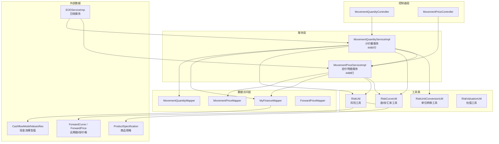
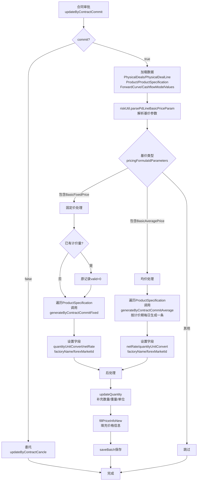
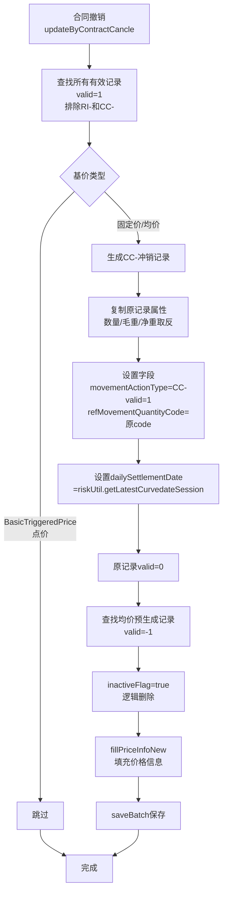
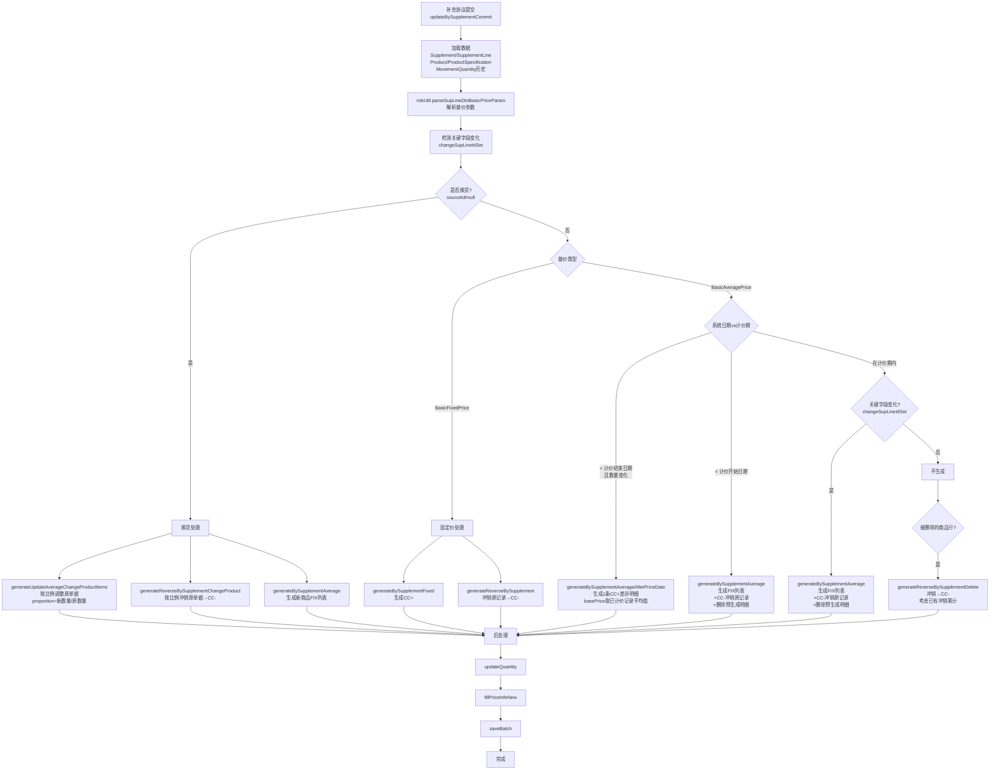
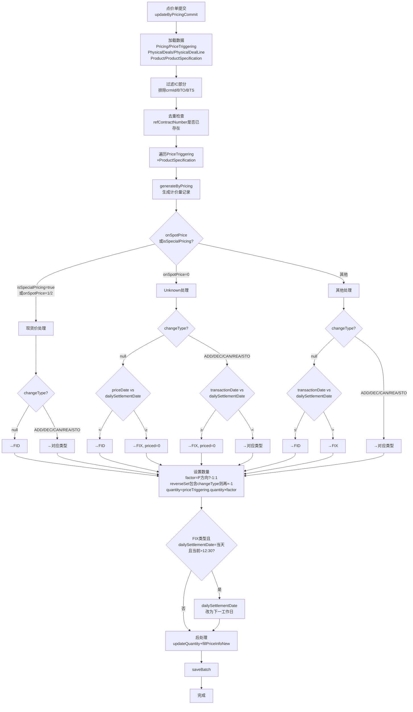
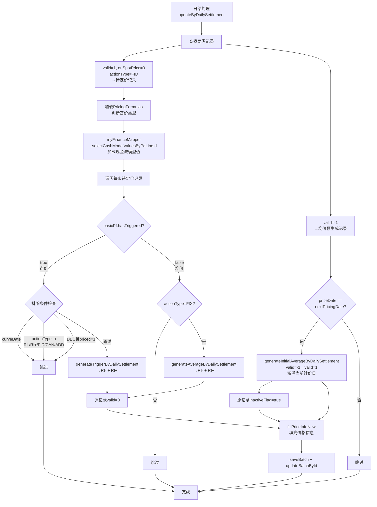
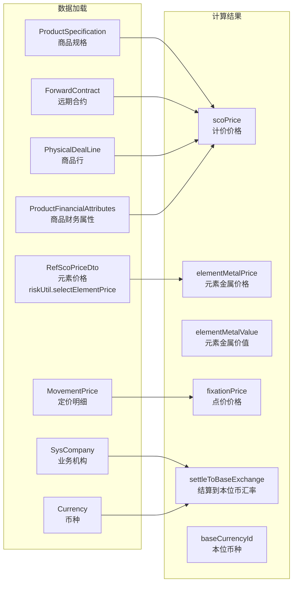
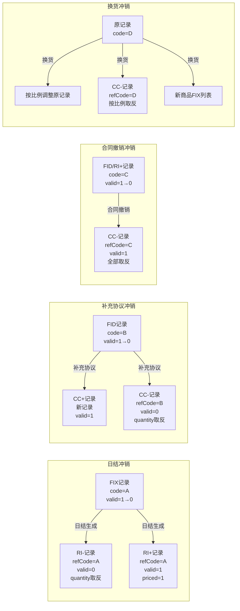

# 计价量模型（MovementQuantity）计算逻辑文档

> [!info] 文档信息
> - **生成日期**：2026-07-01
> - **源码位置**：`MovementQuantityServiceImpl.java`（4480行）
> - **关联文件**：`MovementPriceServiceImpl.java`（4488行）
> - **关联文档**：[[定价明细MovementPrice生成逻辑文档]]

---

## 一、概述

> [!abstract] 功能说明
> 计价量模型（MovementQuantity）与定价明细（MovementPrice）是**平行结构**的两个系统：
> - **MovementPrice**：记录订单的**价格**变动历史（金额、升贴水、汇率等）
> - **MovementQuantity**：记录订单的**数量**变动历史（数量、毛重、净重等）
>
> 两者共享相同的 `movementActionType` 枚举和业务触发时机，但分别维护各自的数据。

### 1.1 核心字段说明

| 字段 | 类型 | 说明 |
|------|------|------|
| `movementActionType` | String | 操作类型：FID / FIX / RI+ / RI- / CC+ / CC- / ADD / DEC / CAN / REA / STO |
| `valid` | Integer | 生效状态：1-生效，0-失效（被冲销），-1-待日结更新 |
| `priced` | Integer | 计价状态：1-已计价，0-未计价 |
| `onSpotPrice` | Integer | 定价方式：0-Unknown，1-On Spot Price，2-Known |
| `quantity` | Double | 计价数量（经过单位转换后的值） |
| `sourceQuantity` | BigDecimal | 原始数量（quantity的BigDecimal副本） |
| `grossWeight` | Double | 毛重 = quantity × levelRate |
| `netWeright` | Double | 净重 = grossWeight × netRate |
| `levelRate` | Double | 品位率（来自商品规格 ProductSpecification.defaultValue） |
| `netRate` | Double | 净率/收率（Yield，来自商品规格中Yield类型的defaultValue） |
| `quantityUnitConvert` | BigDecimal | 重量单位转换系数（分子单位/分母单位） |
| `unitConversion` | BigDecimal | 结算单位到KG的转换系数 |
| `scoPrice` | BigDecimal | 计价价格（元素金属价格） |
| `elementMetalPrice` | BigDecimal | 元素金属价格 |
| `elementMetalValue` | BigDecimal | 元素金属价值 = netWeight × elementMetalPrice |
| `fixationPrice` | BigDecimal | 点价价格（来自关联的MovementPrice） |
| `refMovementQuantityCode` | String | 关联计价量编码，用于冲销引用链 |
| `refDocumentType` | Integer | 关联单据类型：1-现货，2-长协，3-补充协议，4-点价记录 |

### 1.2 数量计算核心公式

```
quantity = 原始数量 × 买卖方向因子(P/S) × 单位转换系数
grossWeight = quantity × levelRate（品位率）
netWeight = grossWeight × netRate（净率/收率）
elementMetalValue = netWeight × elementMetalPrice
```

---

## 二、系统架构总览

### 2.1 服务类关系



### 2.2 方法调用总览

```mermaid
flowchart TB
    subgraph 公开入口方法
        A1[updateByContractCommit<br/>合同审批]
        A2[updateByContractCancle<br/>合同撤销]
        A3[updateBySupplementCommit<br/>补充协议提交]
        A4[updateBySupplementCancle<br/>补充协议撤销]
        A5[updateByPricingCommit<br/>点价提交]
        A6[updateByDailySettlement<br/>日结处理]
        A7[updateMissingPriceByDailySettlement<br/>补填缺失价格]
    end

    subgraph 私有生成方法-合同
        B1[generateByContractCommitFixed<br/>固定价→FID]
        B2[generateByContractCommitAverage<br/>均价→FIX列表]
    end

    subgraph 私有生成方法-补充协议
        C1[generateBySupplementFixed<br/>固定价→CC+]
        C2[generateBySupplementAverage<br/>均价→FIX列表]
        C3[generateBySupplementAverageAfterPriceDate<br/>计价期后→CC+]
        C4[generateReverseBySupplement<br/>冲销→CC-]
        C5[generateReverseBySupplementDelete<br/>删除冲销→CC-]
        C6[generateReverseBySupplementChangeProduct<br/>换货冲销→CC-]
        C7[generateUpdateAverageChangeProductItems<br/>换货比例调整]
    end

    subgraph 私有生成方法-点价
        D1[generateByPricing<br/>点价→FID/FIX/ADD/DEC等]
        D2[generateByPricingForIC<br/>IC点价]
    end

    subgraph 私有生成方法-日结
        E1[generateTriggerByDailySettlement<br/>点价日结→RI-+RI+]
        E2[generateAverageByDailySettlement<br/>均价日结→RI-+RI+]
        E3[generateInitialAverageByDailySettlement<br/>均价初始→激活]
    end

    subgraph 后处理方法
        F1[updateQuantity<br/>补充数量/重量/单位]
        F2[fillPriceInfoNew<br/>填充价格/汇率/金属价]
    end

    A1 --> B1
    A1 --> B2
    A1 --> F1
    A1 --> F2

    A2 --> C4
    A2 --> F2

    A3 --> C1
    A3 --> C2
    A3 --> C3
    A3 --> C4
    A3 --> C5
    A3 --> C6
    A3 --> C7
    A3 --> F1
    A3 --> F2

    A5 --> D1
    A5 --> F1
    A5 --> F2

    A6 --> E1
    A6 --> E2
    A6 --> E3
    A6 --> F2
```



---

## 三、业务流程详解

### 3.1 合同提交流程

**入口方法**：`updateByContractCommit(List<Long> pdIds, Boolean commit)`（第201行）

> [!note] 流程说明
> 当 `commit=false` 时，会委托给 `updateByContractCancle()` 执行撤销逻辑。



#### 3.1.1 固定价合同提交 — `generateByContractCommitFixed`（第519行）

**核心逻辑**：
```
输入：PhysicalDeals（合同）, PhysicalDealLine（商品行）, SpecificationType（规格类型）, ProductSpecification（商品规格）
输出：单条 MovementQuantity 记录
```

| 字段 | 取值逻辑 |
|------|----------|
| `movementActionType` | `FID`（固定初始交易） |
| `valid` | `1`（生效） |
| `priced` | `1`（已计价） |
| `onSpotPrice` | `1`（On Spot Price） |
| `quantity` | `pdLine.quantity × (P方向?-1:1)` |
| `levelRate` | `productSpecification.defaultValue`（品位率） |
| `dailySettlementDate` | `riskUtil.getCurveDate(legalEntityId)` |
| `priceDate` | `pd.contractDate` |
| `session` | `riskUtil.getLatestCurvedateSession().session`，默认3 |
| `refDocumentType` | Spot→1, 长协→2 |

#### 3.1.2 均价合同提交 — `generateByContractCommitAverage`（第582行）

**核心逻辑**：
```
输入：PhysicalDeals, PhysicalDealLine, SpecificationType, ProductSpecification
输出：List<MovementQuantity>（按计价期每日一条）
```

**关键步骤**：
1. 从 `pricingFormulaIdParameters` 解析 `beginDate` / `endDate`
2. 调用 `riskUtil.getPricingDate(beginDate, endDate, forwardContractId)` 获取计价日期列表
3. 数量按天数均分：`quantity = pdLine.quantity / pricingDates.size()`
4. 对每个计价日生成一条记录，根据 `pricingDate` 与 `curveDate` 的关系设置不同状态：

| 条件 | movementActionType | valid | priced | onSpotPrice | dailySettlementDate |
|------|--------------------|-------|--------|-------------|---------------------|
| `pricingDate < curveDate` | FID | 1 | 1 | 1 | curveDate |
| `pricingDate == curveDate` | FIX | 1 | 0 | 0 | pricingDate |
| `pricingDate > curveDate` | FIX | -1 | 0 | 0 | pricingDate |

> [!warning] 12:30规则
> 如果生成的是 FIX 类型，且 `dailySettlementDate == curveDate`，且当前时间已过12:30，则 `dailySettlementDate` 调整为下一个工作日：
> ```java
> riskUtil.getLatestFinancialDate(76L, dailySettlementDate, 1, false)
> ```

---

### 3.2 合同撤销流程

**入口方法**：`updateByContractCancle(List<Long> pdIds)`（第424行）



**关键规则**：
- 排除 `RI-` 和 `CC-` 类型的记录（它们本身已经是冲销记录）
- 排除点价类型（`BasicTriggeredPrice`）
- CC- 冲销记录的 `quantity`、`grossWeight`、`netWeight` 全部取反（乘以-1）
- 均价预生成记录（`valid=-1`）直接标记为 `inactiveFlag=true`，而不是生成 CC-

---

### 3.3 补充协议提交流程

**入口方法**：`updateBySupplementCommit(List<Long> supplementIds)`（第696行）

> [!note] 复杂度说明
> 这是整个计价量系统中最复杂的方法（约400行），涉及换货、非换货、固定价、均价、计价期内/外等多种分支。



#### 3.3.1 均价关键字段（`changeSupLineIdSet`）

以下字段的变化会触发在计价期内重新生成计价量：

| 字段 | 说明 |
|------|------|
| `quantity` | 数量 |
| `quantityUnitId` | 数量单位 |
| `settlementCurrencyId` | 结算币种 |
| `productTaxCodeId` | 税率 |
| `spreadValue` | 升贴水值 |
| `spreadCurrencyId` | 升贴水币种 |
| `spreadUnitId` | 升贴水单位 |
| `spreadIsPercentage` | 升贴水是否百分比 |

#### 3.3.2 补充协议固定价 — `generateBySupplementFixed`（第1526行）

| 字段 | 取值逻辑 |
|------|----------|
| `movementActionType` | `CC_PLUS` |
| `valid` | `1` |
| `priced` | `1` |
| `onSpotPrice` | `1` |
| `quantity` | `supplementLine.quantity × (P方向?-1:1)` |
| `priceDate` | `supplement.contractDate` |
| `dailySettlementDate` | `riskUtil.getCurveDate()` |
| `refDocumentType` | `3`（补充协议） |

#### 3.3.3 补充协议均价 — `generateBySupplementAverage`（第1087行）

与 `generateByContractCommitAverage` 逻辑类似，按计价期每日生成一条。区别在于：
- `refDocumentType` = 3（补充协议）
- `supplementId` / `supplementLineId` 会被设置
- 根据 `pricingDate` 与 `curveDate` 的关系：
  - `pricingDate < curveDate` → CC+，valid=1，priced=1
  - `pricingDate == curveDate` → FIX，valid=1，priced=0
  - `pricingDate > curveDate` → FIX，valid=-1，priced=0

#### 3.3.4 补充协议计价期后 — `generateBySupplementAverageAfterPriceDate`（第1225行）

| 字段 | 取值逻辑 |
|------|----------|
| `movementActionType` | `CC_PLUS` |
| `valid` | `1` |
| `priced` | `1` |
| `quantity` | `(supplementLine.quantity - supplementLine.originalQuantity) × (P方向?-1:1)` |
| `scoPrice` | 取已计价记录的**平均值** |
| `elementMetalPrice` | 取已计价记录的**平均值** |
| `forexConversion` | 取已计价记录的**平均汇率** |

#### 3.3.5 冲销方法 — `generateReverseBySupplement`（第1621行）

**核心逻辑**：
1. 遍历原始计价量列表
2. 跳过 `valid=-1`、`valid=0`、`inactiveFlag=true`、`RI-`、`CC-` 类型的记录
3. 复制原记录属性，数量和重量取反
4. 设置 `movementActionType = CC_MINUS`
5. 设置 `refMovementQuantityCode = 原code`
6. 原记录 `valid` 设为 0

#### 3.3.6 换货冲销 — `generateReverseBySupplementChangeProduct`（第1352行）

**特殊逻辑**：
- 按 `priceDate + specificationTypeId` 分组汇总数量/重量
- 按 `proportion`（新数量/原数量的比例）计算冲销量
- 冲销量 = `proportion × 汇总量 × -1`
- 排除 FIX 类型的记录（只冲销已定价的记录）

---

### 3.4 点价单提交流程

**入口方法**：`updateByPricingCommit(List<Long> pricingIds, LocalDate date)`（第1770行）
**核心方法**：`generateByPricing`（第2233行）



**数量因子（factor）计算**：
```
factor = 1.0
if (psFlag == "P") factor *= -1       // 采购方向取反
if (changeType in {2,3,5}) factor *= -1  // DEC/CAN/STO 取反
quantity = priceTriggering.quantity × factor
```

> [!info] reverseSet
> `reverseSet = {2, 3, 5}`，对应 `PriceChangeTypeEnum` 的 DEC(2)、CAN(3)、STO(5)。
> 这些变更类型会使数量因子再乘以-1，实现"减少/取消/换出"的效果。

---

### 3.5 日结处理流程

**入口方法**：`updateByDailySettlement(List<String> contractNumbers, LocalDate curveDate)`（第2695行）



#### 3.5.1 点价日结 — `generateTriggerByDailySettlement`（第2633行）

**输入**：MovementQuantity（原FIX记录）, CashflowModelValuesRes, curveDate

**生成两条记录**：

| 字段 | RI-（冲销记录） | RI+（新生效记录） |
|------|-----------------|-------------------|
| `movementActionType` | `RI_MINUS` | `RI_PLUS` |
| `valid` | `0` | `1` |
| `priced` | 保持原值 | `1` |
| `quantity` | `原quantity × -1` | `原quantity` |
| `grossWeight` | `原grossWeight × -1` | 保持原值 |
| `netWeight` | `原netWeight × -1` | 保持原值 |
| `refMovementQuantityCode` | `原code` | `原code` |
| `dailySettlementDate` | `max(curveDate, priceDate)` | `max(curveDate, priceDate)` |

#### 3.5.2 均价日结 — `generateAverageByDailySettlement`（第2544行）

**处理条件**：`valid=-1` 的记录（空处理）或 `actionType=FIX` 的记录

**生成两条记录**（与点价日结类似）：

| 字段 | RI- | RI+ |
|------|-----|-----|
| `movementActionType` | `RI_MINUS` | `RI_PLUS` |
| `valid` | `0` | `1` |
| `priced` | `0` | `1` |
| `onSpotPrice` | `0` | `1` |
| `quantity` | `原quantity × -1` | `原quantity` |

#### 3.5.3 均价初始激活 — `generateInitialAverageByDailySettlement`（第2606行）

**处理条件**：`valid=-1` 且 `priceDate == nextPricingDate`

**逻辑**：复制原记录，设置 `valid=1, priced=0`，原记录标记为 `inactiveFlag=true`

---

## 四、后处理方法详解

### 4.1 `updateQuantity` — 补充数量/重量/单位（第2843行）

> [!important] 核心后处理
> 此方法在保存前对所有新生成的计价量记录进行数量和重量的补充计算。

**处理步骤**：

1. **跳过 CC- 和 RI- 类型**（它们已经通过复制+取反设置好了）

2. **补充日结日期**：如果 `dailySettlementDate == null`，取 `riskUtil.getCurveDate()`

3. **补充业务板块**：根据 `oriProductId + factoryCode` 查找 `ProductFactoryBusiness`

4. **单位转换**：
   - 如果商品行的数量单位是 `M`（吨），转换为 `KG`
   - 如果商品ID与商品行商品ID不同，使用主计量单位
   - 设置 `unitConversion`（转换系数）

5. **计算重量**：
   ```
   quantity = unitConversion × quantity（转换后的数量）
   grossWeight = quantity × levelRate（品位率）
   netWeight = grossWeight × netRate（净率/收率）
   ```

6. **设置合约信息**：从 `ForwardCurve` 获取 `contractCurrencyId` 和 `contractQuantityUnitId`

### 4.2 `fillPriceInfoNew` — 填充价格信息（第3969行）

> [!important] 最复杂的后处理方法
> 此方法填充计价价格、元素金属价格、汇率、本位币价格等所有价格相关字段。

**数据准备阶段**：



**核心计算逻辑**（遍历每条计价量记录）：

1. **跳过 FIX 和 RI- 类型**（未计价或冲销记录不需要价格）

2. **设置本位币**：从 `SysCompany` 获取 `baseCurrency`

3. **获取关联定价明细**：通过 `physicalDealLineId + movementActionType + priceDate + valid + priced` 匹配 MovementPrice

4. **计算点价价格**（fixationPrice）：
   ```
   fixationPrice = movementPrice.settlementNetPrice / mpSettleUnitToMqConversion
   ```

5. **确定最终定价日期**：从 `dailySettlementDate` 向前找到最近的有价格的交易日

6. **获取结算币种到本位币汇率**：
   ```
   settleToBaseExchange = riskCurveUtil.getExchangeRateNew(
       publicationId, settlementCurrencyId, baseCurrencyId, finalPricingDate)
   ```

7. **获取当前元素价格**：
   - 按 `productId + specificationTypeId` 查找
   - 优先匹配 `factoryCode` 分类，其次 `Fixation` 分类
   - 优先匹配 `finalPricingDate`，其次 `finalPricingDatePre`（前一交易日）

8. **计算元素金属价值**：
   ```
   elementMetalValue = netWeight(KG) × elementMetalPrice × yield
   ```

9. **计算计价价格（scoPrice）**：
   - 如果商品财务属性为 `Z002`/`Z003`（有金属价的商品）：使用 `riskUtil.getScoPrice()` 获取
   - 否则：从关联的 MovementPrice 获取 `basePrice`
   - 进行币种转换和单位转换

---

## 五、冲销引用链关系



---

## 六、完整操作对照表

| 操作 | 基价类型 | 条件 | 生成类型 | valid | priced | 数量来源 |
|------|----------|------|----------|-------|--------|----------|
| 合同提交 | 固定价 | - | **FID** | 1 | 1 | pdLine.quantity |
| 合同提交 | 均价 | - | **FIX**（每日一条） | -1/1 | 0/1 | pdLine.quantity / 天数 |
| 合同提交 | 点价 | - | 不生成 | - | - | - |
| 点价提交 | - | onSpotPrice=1/2, changeType=null | **FID** | 1 | 1 | priceTriggering.quantity |
| 点价提交 | - | onSpotPrice=1/2, changeType=ADD | **ADD** | 1 | 1 | priceTriggering.quantity |
| 点价提交 | - | onSpotPrice=1/2, changeType=DEC | **DEC** | 1 | 1 | priceTriggering.quantity × -1 |
| 点价提交 | - | onSpotPrice=1/2, changeType=CAN | **CAN** | 1 | 1 | priceTriggering.quantity × -1 |
| 点价提交 | - | onSpotPrice=0, priceDate < dailySettlementDate | **FID** | 1 | 1 | priceTriggering.quantity |
| 点价提交 | - | onSpotPrice=0, priceDate ≥ dailySettlementDate | **FIX** | 1 | 0 | priceTriggering.quantity |
| 日结处理 | 点价 | curveDate ≥ priceDate | **RI-** + **RI+** | 0/1 | -/1 | 原quantity/原quantity×-1 |
| 日结处理 | 均价 | actionType=FIX | **RI-** + **RI+** | 0/1 | 0/1 | 原quantity/原quantity×-1 |
| 日结处理 | 均价 | valid=-1, priceDate=nextPricingDate | 激活为valid=1 | 1 | 0 | 保持原值 |
| 补充协议 | 固定价 | - | **CC+** + **CC-** | 1/0 | 1/- | supplementLine.quantity |
| 补充协议 | 均价 | 系统日期 > 计价结束日期 且数量变化 | **CC+**（差异） | 1 | 1 | 新旧数量差 |
| 补充协议 | 均价 | 系统日期 < 计价开始日期 | **FIX** + **CC-** | -1/0 | 0/- | supplementLine.quantity / 天数 |
| 补充协议 | 均价 | 计价期内 且 关键字段变化 | **FIX** + **CC-** | -1/0 | 0/- | supplementLine.quantity / 天数 |
| 补充协议 | 均价 | 换货 | 调整原记录 + **CC-** + 新**FIX** | 混合 | 混合 | 按比例 |
| 补充协议 | 点价 | - | 不生成 | - | - | - |
| 合同撤销 | 固定价/均价 | - | **CC-**（冲销所有有效记录） | 1 | - | 原quantity × -1 |
| 合同撤销 | 点价 | - | 不生成 | - | - | - |

---

## 七、关键依赖方法索引

### 7.1 RiskUtil 工具方法

| 方法 | 调用位置 | 功能 |
|------|----------|------|
| `getCurveDate(legalEntityId)` | 多处 | 获取当前曲线日期（交易日） |
| `getLatestCurvedateSession(legalEntityId)` | 多处 | 获取最新的曲线日期会话（含date和session） |
| `getPricingDate(beginDate, endDate, forwardContractId)` | 均价生成 | 获取计价日期列表（排除非交易日） |
| `getLatestFinancialDate(calendarId, date, offset, includeSelf)` | 12:30规则 | 获取最近的工作日 |
| `getPreAndNextWorkingDate(curveDate, null)` | 日结 | 获取前一和下一工作日 |
| `parsePdLineBasicPriceParam(pdLines)` | 多处 | 解析商品行的基价参数（JSON→Map） |
| `parseSupLineDtoBasicPriceParam(supLineDtos)` | 补充协议 | 解析补充协议行的基价参数 |
| `parseBasicPriceParam(parameters)` | 均价生成 | 解析单个基价参数JSON |
| `selectElementPrice(productIds, dates, null, 0)` | fillPriceInfoNew | 查询元素金属价格 |
| `getScoPrice(productId, date, legalEntityId)` | fillPriceInfo | 获取SCo价格 |
| `getScoPriceWithoutCu(productId, date, unitId, currencyId, legalEntityId, marker)` | fillPriceInfo | 获取无币种限制的SCo价格 |
| `getCurrentTaxRate(taxCodeId, date)` | fillBasicInfo | 获取当前税率 |

### 7.2 RiskCurveUtil 曲线工具方法

| 方法 | 调用位置 | 功能 |
|------|----------|------|
| `getExchangeRateNew(publicationId, fromCurrencyId, toCurrencyId, date)` | fillPriceInfoNew | 获取汇率（新版） |
| `getExchangeRate(fromCurrencyId, toCurrencyId, date)` | fillBasicInfo | 获取汇率 |
| `getBaseCurrency(legalEntityId)` | fillBasicInfo | 获取本位币 |
| `initExchangeMap(publicationIds, dates)` | fillPriceInfoNew | 预加载汇率数据（批量优化） |

### 7.3 RiskUnitConversionUtil 单位转换方法

| 方法 | 调用位置 | 功能 |
|------|----------|------|
| `getUnitConversion(fromUnitId, toUnitId)` | 多处 | 获取单位转换系数 |
| `getUnitConversionNew(fromUnitId, toUnitId, productId)` | fillPriceInfoNew | 获取单位转换系数（新版，考虑商品） |
| `initUnitConversionMap(type, productIds)` | fillPriceInfoNew | 预加载单位转换数据 |

### 7.4 MyFinanceMapper 现金流查询

| 方法 | 调用位置 | 功能 |
|------|----------|------|
| `selectCashModelValuesByPdLineId(pdLineIds)` | 合同提交/日结/fillPriceInfo | 查询现金流模型主值（spread/otherCostPrice/settlementNetPrice） |
| `selectCashflowModelPricingDetailsByPdLineId(pdLineIds)` | fillPriceInfo/fillPriceInfoNew | 查询现金流定价行明细 |

---

## 八、MovementQuantity 与 MovementPrice 的对比

| 维度 | MovementQuantity（计价量） | MovementPrice（定价明细） |
|------|---------------------------|--------------------------|
| **核心关注** | 数量、重量、金属价值 | 价格、升贴水、汇率、金额 |
| **服务类** | MovementQuantityServiceImpl | MovementPriceServiceImpl |
| **行数** | 4480行 | 4488行 |
| **数量计算** | `quantity × levelRate → grossWeight × netRate → netWeight` | `quantity`（直接使用合同数量） |
| **价格来源** | `riskUtil.selectElementPrice` / `movementPrice.basePrice` | `CashflowModelValues` / `ForwardPrice` / `PriceTriggering` |
| **单位转换** | 结算单位→KG，考虑商品规格 | 合约单位→结算单位 |
| **后处理** | `updateQuantity` + `fillPriceInfoNew` | `fillBasicInfo` + `fillPriceInfo` / `fillPriceInfoNew` |
| **IC处理** | `generateByPricingForIC` | `generateByPricingForIC` + `fillPriceInfoForIC` |
| **关联关系** | `movementPriceId` 指向 MovementPrice | 通过 `physicalDealLineId + actionType + priceDate` 被查找 |

---

## 九、注意事项

> [!warning] 重要规则
> 1. **点价类型（BasicTriggeredPrice）** 在合同提交和补充协议提交时都不生成计价量，只在日结处理时生成 RI-/RI+
> 2. **均价预生成记录**（valid=-1）在合同撤销时被标记为 `inactiveFlag=true`，而不是生成 CC-
> 3. **12:30规则**：点价/均价生成 FIX 类型时，如果 `dailySettlementDate == curveDate` 且当前时间已过12:30，`dailySettlementDate` 会调整为下一个工作日
> 4. **数量因子**：P（采购）方向的数量会乘以-1；DEC/CAN/STO 变更类型也会乘以-1
> 5. **CC- 和 RI- 跳过**：`updateQuantity` 和 `fillPriceInfoNew` 都会跳过冲销类型记录（它们已经通过复制+取反设置好了）
> 6. **fillPriceInfoNew 跳过 FIX 和 RI-**：未计价的 FIX 和冲销的 RI- 不需要填充价格
> 7. **均价计价期后补充协议**：CC+ 差异明细的 `scoPrice` 和 `elementMetalPrice` 取已计价记录的**平均值**
> 8. **换货比例计算**：`proportion = 新数量 / 原数量`，冲销量 = `proportion × 汇总量 × -1`
> 9. **日结触发时机**：手动触发，不是定时任务自动执行
> 10. **IC点价**：通过 `updateByPricingCommitForIC` 单独处理，排除 Normal 类型，只处理 BTO/BTS
