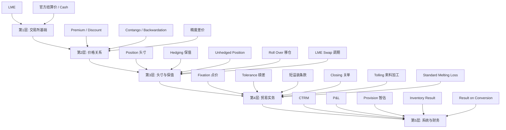
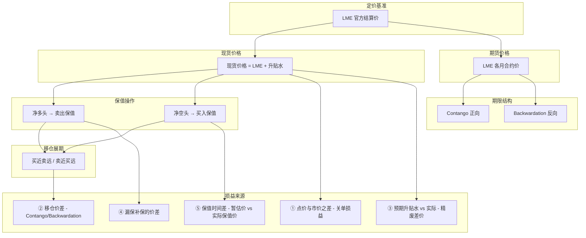

[[Monthly Mgmt 科目逻辑梳理]]
[[期货现货标准术语手册|期货现货知识]]

# 期货现货标准术语手册

> [!abstract] 文档说明
> 本手册从 [[Monthly Mgmt 科目逻辑梳理]] 中提炼所有期货现货相关的**行业标准概念**，给出官方定义与本项目对应场景。
> 建议按顺序学习，由浅入深。

---

## 一、交易所与价格基准

### 1.1 LME（London Metal Exchange，伦敦金属交易所）

> [!info] 标准定义
> LME 成立于 1877 年，是全球最大的**工业金属交易所**，也是有色金属（铜、铝、锌、铅、镍、锡等）的**全球定价基准**。
>
> **三大核心功能**：
> - **价格发现**：通过公开交易形成全球公认的金属参考价
> - **风险管理**：提供期货、期权合约供产业客户套期保值
> - **实物交割**：合约到期可通过认证仓库交割实物金属
>
> **主要交易品种**：铜（Grade A）、铝、锌、铅、镍、锡、铝合金、钴等。

**本项目应用**：
公司所有原材料（铜废料、锌锭等）的采购价、产品销售价、库存估值、保值对冲，全部以 LME 价格作为基准。LME 价是整个业务链条的 ==锚==。

---

### 1.2 LME 官方结算价（Official Settlement Price）

> [!info] 标准定义
> LME 每个交易日在 ==官方交易圈（Official Ring）== 结束后公布的成交价。
>
> Ring 是 LME 特有的**公开喊价交易环节**，每天分两轮：
> - 第一轮：约 11:45 - 13:00（伦敦时间）
> - 第二轮：约 16:15 - 17:00（伦敦时间）
>
> 官方结算价 = 第二轮 Ring 结束时的**官方成交价**，被全球产业作为当日定价基准。

**本项目应用**：
- 每日计算 Cartellino（合金销售基价）时，代入 LME 官方结算价
- 月末 Greenlist 估值取当月最后一天的 LME 官方结算价

---

### 1.3 LME 现金价格（LME Cash / Spot Price）

> [!info] 标准定义
> LME 的**现货合约**（Cash Contract）价格，即 ==T+0 或 T+1 立即交割== 的价格。
>
> 与期货价格（3 个月、15 个月等远期合约）相对应。Cash 价格反映当前现货市场的即时供需。

**本项目应用**：
- 库存暂估的价值计算：`暂估量 × 当月最后一天 LME Cash 价格`
- 月末库存估值基准

> [!tip] 对比理解
> | 价格类型 | 性质 | 用途 |
> | :---: | :---: | :--- |
> | 官方结算价 | 当日标准参考价 | 每日定价基准 |
> | Cash 价格 | 现货合约成交价 | 库存估值基准 |
>
> 两者接近但不完全相同。

---

## 二、现货与期货的价差关系

### 2.1 Premium / Discount（升水 / 贴水）

> [!info] 标准定义
> 升贴水是**现货价格与期货价格之间**、或**实际交易价与基准价之间**的差额。
>
> - **Premium（升水/溢价）**：实际价 > 基准价，差值为正
> - **Discount（贴水/折扣）**：实际价 < 基准价，差值为负
>
> **产生原因**：品质差异、运输成本、仓储成本、供需紧张程度、交割地点差异等。

**两种常见语境**：

| 语境 | 含义 | 举例 |
| :---: | :--- | :--- |
| 期现价差 | 现货价 vs 期货价 | 现货铜比 3 个月期货贵 50 美元 |
| 品质/地区价差 | 实际采购价 vs LME 基准价 | "LME - 500 欧元/吨" |

**本项目应用**：
- 原材料采购价 = `LME 价格 + 升贴水`（如 "LME 铜价 - 500 欧元/吨"，-500 即为贴水）
- ==Greenlist 估值== 使用当月所有采购入库的**平均升贴水**
- **预期折扣 vs 实际折扣**的差异形成"采购精废差价损益"

---

### 2.2 Contango（正向市场 / 远月升水）

> [!info] 标准定义
> 期货市场的一种期限结构形态：
>
> $$远期期货价格 > 近期期货价格 > 现货价格$$
>
> **成因**：持有成本（Cost of Carry），包括仓储费、保险费、资金利息等。远期合约隐含更多持有成本，所以价格更高。

**对产业的影响**：
- 持有现货的一方可以"卖近买远"进行 ==移仓套利（Cash & Carry Arbitrage）==
- 空头移仓时（卖近月买远月）会产生**盈利**（卖低买高）

---

### 2.3 Backwardation（反向市场 / 远月贴水）

> [!info] 标准定义
> 与 Contango 相反：
>
> $$现货价格 > 近期期货价格 > 远期期货价格$$
>
> **成因**：当前现货供应紧张、需求旺盛，买家愿意为立即获得现货支付溢价，称为 ==便利收益（Convenience Yield）==。

**对产业的影响**：
- 持有现货的一方获得便利收益
- 空头移仓时（卖近月买远月）会产生**亏损**（卖高买低）

> [!example] 本项目应用
> 文档原文：
> > "若市场处于 Contango，展期盈利；若 Backwardation，则亏损。"
>
> LME 调期业务（Roll Over）的盈亏，本质上就是在 Contango/Backwardation 结构下移仓的价差损益。

---

### 2.4 精废差价（Refined-Scrap Spread）

> [!info] 标准定义
> **精炼金属（如电解铜）价格与废金属（如铜废料）价格之间的差额**。反映废金属相对精炼金属的折价程度，是金属回收行业的关键盈利指标。
>
> $$精废差价 = 精炼金属价格 - 废金属价格$$
>
> **影响因素**：废金属供应充足程度、品质、回收率、环保政策等。

**本项目应用**：
- 采购端预期折扣 vs 实际折扣的差异
- 反映采购部门"买得比预期便宜多少"的能力

---

## 三、头寸与保值

### 3.1 Position（头寸）

> [!info] 标准定义
> 交易者持有的**未平仓合约数量**，代表其在某一资产上的风险敞口。

**按买卖方向分**：

| 类型 | 中文叫法 | 含义 |
| :---: | :---: | :---: |
| Long Position | 多头头寸 / 做多 | 已买入但未卖出，价格上涨获利 |
| Short Position | 空头头寸 / 做空 | 已卖出但未买入，价格下跌获利 |
| Flat / Closed | 平仓 / 零头寸 | 买卖相抵，无持仓 |

**按业务口径分**：

| 类型 | 英文 | 计算方式 | 说明 |
| :---: | :---: | :--- | :--- |
| 净头寸 | Net Position | 多头 - 空头 | 正数=净多，负数=净空 |
| 总头寸 | Gross Position | 多头 + 空头的绝对值之和 | 反映总敞口规模 |
| 敞口头寸 | Open Position | 还未平仓的部分 | 即未平仓合约量 |

> [!abstract] 基本公式
> $$净头寸 = 买入量 - 卖出量$$
>
> | 计算结果 | 含义 |
> | :---: | :---: |
> | 净头寸 > 0 | 净多头 |
> | 净头寸 < 0 | 净空头 |
> | 净头寸 = 0 | 平仓 |

> [!example] 举例：铜期货
> 假设某贸易商在一天内做了以下铜期货操作（每手 = 5 吨）：
>
> **① 交易记录**
>
> | 操作 | 数量 | 方向 |
> | :---: | :---: | :---: |
> | 买入开仓 | 10 手 | 多 |
> | 卖出开仓 | 4 手 | 空 |
> | 买入平仓 | 2 手（平之前的空） | - |
>
> **② 头寸计算**
>
> | 指标 | 计算过程 | 结果 |
> | :---: | :--- | :---: |
> | 多头持仓 | 10 手（未平） | **10 手** |
> | 空头持仓 | 4 - 2 = 2 手（未平） | **2 手** |
> | 净头寸 | 10 - 2 = +8 手 | **净多头 8 手（= 40 吨铜）** |
> | 总头寸 | 10 + 2 = 12 手 | **12 手** |

**本项目的头寸来源**：

| 来源 | 头寸方向 | 说明 |
| :---: | :---: | :--- |
| 来料加工利润金属 | 净多头 | 投入产出差剩下的金属 |
| 库存盘盈/盘亏 | 多/空 | 实际库存 vs 系统预期的差异 |
| 销售合同 | 净空头 | 已卖出待交货 |
| 采购合同 | 净多头 | 已买入待到货 |
| 关单余量 | 头寸减少 | 关闭合同后释放头寸 |

---

### 3.2 Exposure（风险敞口）

> [!info] 标准定义
> 因价格、汇率、利率等市场变量变动可能导致损失的**风险暴露量**。在大宗商品领域，通常指未保值的净头寸。
>
> $$风险敞口 = 未保值头寸 \times 价格波动幅度$$

**本项目应用**：
- Eric 提供库存盘点敞口数据给风控人员
- 敞口数据需要系统实时计算和汇总

---

### 3.3 Hedging（保值 / 套期保值）

> [!info] 标准定义
> 在期货市场建立与现货市场**方向相反**的头寸，以对冲价格波动风险。核心原则是"一个市场亏损，另一个市场盈利，相互抵消"。

**两种基本类型**：

| 类型 | 操作 | 适用场景 |
| :---: | :--- | :--- |
| **Short Hedge（卖出保值）** | 在期货市场卖出 | 持有现货/将卖出，担心价格下跌 |
| **Long Hedge（买入保值）** | 在期货市场买入 | 将买入现货，担心价格上涨 |

> [!example] 本项目的保值场景
>
> **场景一：来料加工利润金属的保值**
> ```
> 来料加工产生利润金属（如 1.74 公斤铜）
> → 形成公司净多头头寸
> → 风控人员在 LME 卖出保值
> → 如果当月业务量大，累积成可观头寸
> ```
>
> **场景二：库存暂估的保值**
> ```
> 每月预估盘盈亏量（如 +10 吨铜）
> → 盘盈 = 净多头 → 卖出保值
> → 盘亏 = 净空头 → 买入保值
> ```
>
> **场景三：销售点价后的即时保值**
> ```
> 销售点价锁定价格（如 5000 欧元/吨）
> → 风控需立即在 LME 买入对冲
> → 买入的是远期合约，与现货价之差（升贴水）立即产生损益
> ```

> [!warning] 保值的时间风险
> 文档原文：
> > "理想情况下，应在次月第一周拿到准确数据后立即执行。记录中提到的'延迟'（12月数据到1月中才出来），导致保值操作延迟，暴露了价格风险。"
>
> **案例**：如果不做每月暂估对冲，假设半年后盘盈 100 吨，此时铜价已从月初 9000 美元跌至 7000 美元，公司将因未能及时卖出而蒙受 **每吨 2000 美元的损失**。

---

### 3.4 Unhedged Position（未保值头寸）

> [!info] 标准定义
> 总净头寸中**尚未通过期货、期权等工具对冲**的部分，是公司实际暴露在价格风险下的量。
>
> $$未保值头寸 = 净头寸 - 已保值头寸$$

**本项目应用**：
- 每月初 CTRM 系统计算出上月末的未保值净头寸
- 风控人员（Jingjing）根据此数据在 LME 执行保值
- 理想情况：次月第一周拿到数据后立即执行

---

### 3.5 Roll Over（移仓 / 展期）

> [!info] 标准定义
> 期货合约临近到期时，将现有持仓**平仓并同时建立更远月份合约**的操作。目的是维持保值头寸，避免进入实物交割。
>
> **常见操作**：
> - 空头移仓：买入近月平仓 + 卖出远月开仓
> - 多头移仓：卖出近月平仓 + 买入远月开仓
>
> **移仓损益** = 近月合约平仓价 - 远月合约开仓价（考虑方向）

**本项目应用**：
- 风控人员每月根据未保值头寸在 LME 进行移仓
- 移仓盈亏 + 当日保值盈亏 合计记入"Contango/Backwardation"科目

---

### 3.6 LME Swap（LME 调期 / 掉期）

> [!info] 标准定义
> 同时买入和卖出**不同交割月份**的同一金属合约，锁定两个合约之间的价差。本质是一种 ==跨期套利== 工具。
>
> **典型用途**：
> - 将近期头寸转移到远期
> - 利用 Contango/Backwardation 结构赚取价差
> - 调整保值合约的到期时间

**本项目应用**：
- 文档中"Contango/Backwardation"科目记录的就是 LME 调期业务的盈亏
- 包含两部分：当下保值产生的盈亏 + 到期转期时的盈亏

---

### 3.7 漏保补保

> [!info] 标准定义
> 因操作失误（忘记保值、系统延迟录入）导致风险敞口暴露，后续补保时产生的额外盈亏。属于**操作风险**范畴。
>
> $$损益 = (补保时价格 - 应保时价格) \times 数量$$

> [!warning] 风险提示
> 此类事件较少，但金额可能巨大。在黄铜业务中通常计入"others"并在备注中说明；在门登报表中单独设"特殊解释"行记录。

---

## 四、贸易与合同术语

### 4.1 Fixation（点价）

> [!info] 标准定义
> 在大宗商品贸易中，合同通常不约定固定价格，而是约定**定价公式**（如 "LME + Premium"）。
>
> ==点价== 是指合同双方根据约定，在某一时刻**确定最终结算价格**的行为。点价后，价格被"锁定（Fixed）"。
>
> **点价权**：合同中会约定哪一方拥有点价权（买方或卖方）。

**本项目应用**：
- 销售点价：与客户约定售价
- 采购点价：与供应商约定买价
- 点价单（Fixation Note）记录点价日期、价格、数量
- 关单时需要追溯点价日期与点价价格

---

### 4.2 Tolerance（磅差 / 称重公差）

> [!info] 标准定义
> 在散装货物交易中，由于**称重设备精度、运输损耗、水分蒸发**等因素，实际交货重量与合同约定重量之间允许的微小差异。通常以百分比表示（如 ±0.5%）。

**本项目应用**：
- 单次发货时发票量与实收量的微小差异
- 与"关单余量"是两回事（文档特别澄清）

---

### 4.3 More or Less Clause（短溢装条款）

> [!info] 标准定义
> 合同中约定的**数量浮动范围**，允许卖方在交货时多交或少交一定比例（如 ±5%、±10%），买方必须接受。常见于散装大宗商品贸易，因为实际装运量难以精确控制。
>
> **结算方式**：短溢装部分按合同单价或装运日市价结算。

**本项目应用**：
- 合同约定 100 吨，允许 ±5% 的短溢装
- 在短溢装范围内的余量可**自动关单**
- 超出范围需**手动关单**并经管理层审批

---

### 4.4 Closing（关单）

> [!info] 标准定义
> 在大宗商品贸易中，当合同执行完毕（或提前终止）时，将**合同剩余未执行数量关闭**的操作。关单时会按市场价格与合同价格之差计算损益。

> [!abstract] 关单损益公式
> $$关单损益 = (关单时市场价 - 原合同点价价) \times 剩余数量$$

> [!example] 举例
> - 1月2日：点价锁定 10 吨，价格 5000 欧元/吨
> - 2月28日：实际发货 9.98 吨
> - 3月3日：关闭剩余 0.02 吨，此时市场价已跌至 4000 欧元/吨
> - 关单损益 = (4000 - 5000) × 0.02 = **-20 欧元（亏损）**

**两种关单方式**：

| 类型 | 范围 | 审批 |
| :---: | :--- | :---: |
| 自动关单 | 合同磅差/短溢装范围内（如 ±5%） | 无需审批 |
| 手动关单 | 超出正常偏差的剩余量 | 需管理层审批 |

> [!tip] 关单对头寸的影响
> 文档原文：
> > "关掉 0.02 吨的销售合同，意味着公司的净空头头寸减少了 0.02 吨。风险管理需要准确知道这一变化，才能进行正确的保值对冲。"

---

### 4.5 Tolling / Conversion（来料加工）

> [!info] 标准定义
> 客户提供原材料，加工厂利用自己的设备和工艺进行加工，**收取加工费**，成品返还给客户。加工方不拥有原材料所有权，只赚取加工利润。

**与经销业务（Merchanting）的区别**：

| 维度 | 经销业务 | 来料加工 |
| :---: | :--- | :--- |
| 原料所有权 | 自购 | 客户提供 |
| 价格风险 | 承担 | 不承担 |
| 利润来源 | 买卖价差 + 加工费 | 加工费 + 投入产出差 |

**本项目应用**：
- 客户提供车屑等废料
- 公司熔炼后生产成品合金返还
- 利润来源：投入产出差（标准熔炼损耗 vs 实际损耗）

---

### 4.6 Standard Melting Loss（标准熔炼损耗）

> [!info] 标准定义
> 在金属熔炼过程中，由于**氧化、挥发、炉渣夹带**等原因，投入的金属量与产出的成品量之间存在差异。标准熔炼损耗是企业根据历史数据和工艺水平制定的**理论损耗率**。
>
> $$标准熔炼损耗率 = \frac{投入量 - 标准产出量}{投入量} \times 100\%$$
>
> $$标准产出率 = 1 - 标准熔炼损耗率$$

**本项目应用**：
- 每种废料（物料号）维护一个标准产出率（如 93.6%）
- 商业利润计算：
  ```
  利润公斤数 = (客户投入量 × 标准产出率) - 返还客户量
  ```
- 示例：客户投入 110 公斤，标准产出率 93.6%，理论产出 103 公斤，返还 100 公斤 → 公司利润 3 公斤
- 实际损耗 vs 标准损耗的差异在盘点时体现

---

## 五、生产与配方

### 5.1 BOM（Bill of Materials，物料清单 / 配方）

> [!info] 标准定义
> 生产单位产品所需的**原材料、零部件清单及用量**。是制造业的核心基础数据，用于成本核算、物料需求计划（MRP）、生产投料控制。

**本项目应用**：
- 合金生产的标准配方（如 C32：铜废料 10kg + 锌锭 20kg + 车屑 30kg + 混合废料 50kg）
- 标准配方多年不变，用于计算 Cartellino 的理论成本
- 实际投料 vs 标准配方的差异形成"配方优化损益"：
  $$损益 = \sum(实际用量 \times 实际采购价) - \sum(标准用量 \times 标准配方价)$$

---

## 六、财务与系统

### 6.1 CTRM（Commodity Trading and Risk Management）

> [!info] 标准定义
> 大宗商品交易与风险管理系统，是大宗商品行业的**核心业务系统**。
>
> **主要功能**：
> - 交易录入与管理（点价、合同、关单）
> - 头寸管理（实时计算净头寸、未保值头寸）
> - 风险管理（VaR、敞口监控、保值跟踪）
> - 损益核算（按业务线、客户、产品拆分损益）
> - 与 ERP（如 SAP）对接，生成财务凭证
>
> **常见供应商**：
> - 金仕达（Kingstar）— 国内领先
> - 端点科技（Endpoint）
> - Summit（Finastra）
> - Allegro（Envision）
> - Ion/comtreasura

**本项目应用**：
- 公司使用 CTRM 系统（新上线）管理全业务链
- 与 SAP（财务）、CRM（客户关系）对接
- 当前痛点：新系统报表功能缺失，部分损益被归入"Others"

---

### 6.2 P&L（Profit and Loss，损益表）

> [!info] 标准定义
> 反映企业在一定期间内**收入、成本、费用、利润**的财务报表。基本结构：
>
> $$收入 - 成本 = 毛利润$$
> $$毛利润 - 费用 = 营业利润$$
> $$营业利润 \pm 营业外收支 = 净利润$$

**本项目应用**：
管理报表（Management P&L）将金属损益拆分为多行（Line 1-7 + Others）：

| 行号 | 科目 | 来源 |
| :---: | :--- | :--- |
| Line 1 | Directional Margin（定价利润） | 经销业务直接收益 |
| Line 2 | Discounts on Full Price（全价经销折扣） | 特殊折扣 |
| Line 3 | Result on Conversion（来料加工损益） | 投入产出差 |
| Line 4 | Closing of Sales Fixations（销售关单） | 合同余量关闭 |
| Line 5 | Inventory Result（存货盘点） | 月度暂估 + 半年度盘点 |
| Line 6 | Fe + Fines from Slags（炉渣烟尘） | 副产品销售 |
| Line 7 | Contango/Backwardation（调期） | LME 移仓 + 当日保值 |
| Others | 其他（无法归类的损益） | 黑箱项 |

---

### 6.3 YTD（Year-To-Date，年初至今）

> [!info] 标准定义
> 从本年度第一天到当前日期的**累计值**。常用于财务指标对比（如 YTD 收入、YTD 利润）。

**本项目应用**：
- "全价经销折扣 YTD 为 3.2 万欧元"

---

### 6.4 Provision（暂估）

> [!info] 标准定义
> 会计上的**预计负债/预计费用**，指在金额或时间不确定时，基于最佳估计预先计提的费用或损失。遵循 ==谨慎性原则（Prudence Concept）==。

**本项目应用**：
- 月度暂估：每月预估可能的盘盈亏，并让风控对冲
- 计算：
  $$月度暂估量 = \frac{过去两年平均盘盈亏}{6}$$
- 目的：将半年度盘点的"一次性冲击"平滑为每月渐进调整

> [!example] 案例：Serravalle 2025 年的调整
> - 背景：Serravalle 工厂在 2023 年底出现了重大盘亏
> - 决策：管理层将每月暂估量从之前的水平大幅降低至几乎为零
> - 逻辑：宁可少预估利润，也不要最后实际盘点时发现预估过高而导致利润回调

---

### 6.5 Inventory Result（存货盘点结果）

> [!info] 标准定义
> 实物盘点数量与账面数量之间的差异，经价格换算后的**金额**。
>
> - **盘盈（Inventory Gain）**：实际 > 账面
> - **盘亏（Inventory Loss）**：实际 < 账面

**本项目应用**：
- **两层结构**：月度暂估 + 半年度实际盘点
- 差异来源：熔炼损耗波动、操作失误、偷盗、数据录入错误等
- 估值基准：月末 LME Cash 价格

> [!warning] 数据质量是生命线
> 文档反复强调：盘点结果的有效性，完全依赖于系统内日常移动记录（movements）的准确性。
>
> **案例 A：柏林的"被盗卡车"**
> - 现象：年底盘点盘亏 70 吨
> - 真相：有卡车货物被盗，但移动记录未更新
> - 修正：扣除 25 吨失误后，真正盘亏 45 吨
>
> **案例 B：门登的"不可能盘盈"**
> - 现象：门登（没有熔炼炉）盘盈 200 吨
> - 真相：有人错误录入了一笔 200 吨的移动记录

---

### 6.6 Result on Conversion（来料加工损益）

> [!info] 标准定义
> 来料加工业务中，加工方通过**投入产出差**获得的金属利润，按市价折算成的金额。是来料加工业务的核心利润来源。

**本项目的估值逻辑（Greenlist）**：

```
利润公斤数 = (客户投入量 × 标准产出率) - 返还客户量
利润金额 = Σ(各金属公斤数 × Greenlist 价格)
```

> [!tip] Greenlist 价格计算
> $$Greenlist = LME 月末结算价 + 当月平均升贴水 - 固定加价$$
>
> - 基础是 LME 月末结算价
> - 加减当月平均升贴水（反映现货采购的真实成本）
> - 减去固定加价（还原金属本身的"无利润"价值，因为是内部估值）

---

## 七、学习路径建议

> [!success] 推荐学习顺序
> 由浅入深，分 5 层递进：



---

## 八、附录：核心知识框架图



---

## 相关链接

- [[Monthly Mgmt 科目逻辑梳理]] - 本项目业务逻辑梳理
- [[期货基础知识]] - 头寸入门知识
- [[金属损益（Metal Result）及管报重构项目进度汇报及问题沟通]] - 项目进度
