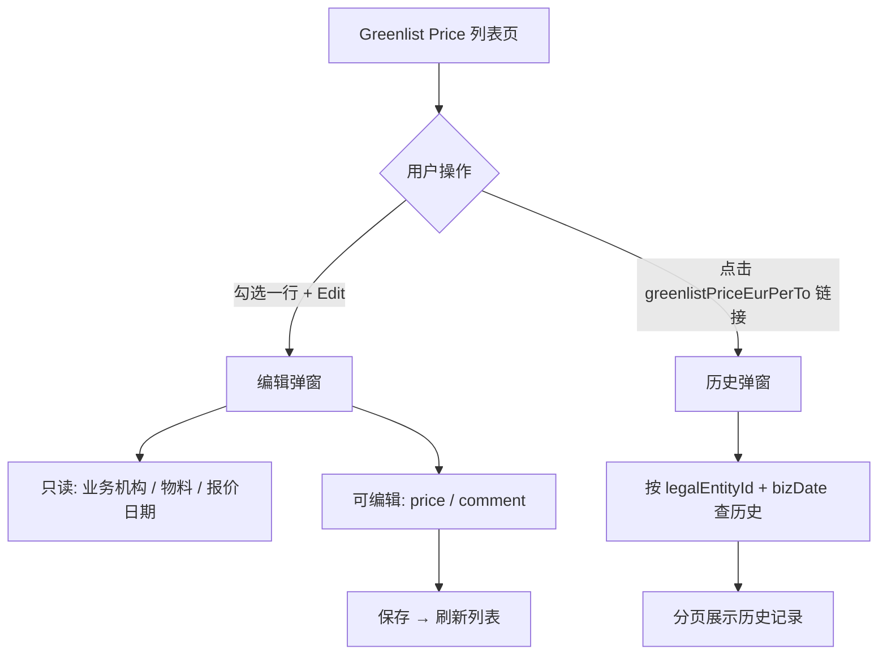

# 原始需求

## Greenlist Price弹窗录入规则

1、弹窗标题：**【Greenlist Price** **价格****编辑/Greenlist Price Edit】**

2、字段说明：

- 业务机构 Company：根据选择单据自动带出；
- 商品 Article：根据选择单据自动带出；
- 行情日期 Date：根据选择单据自动带出；
- **Greenlist** **价格** **Greenlist Price/（****Eur****/To） ：输入框，必填，默认空，数值，支持5位小数；**
- 备注 Comment：输入框，非必填，默认空，手动输入文字说明，限制输入字符长度100字符；


## 弹窗数据存储和生效规则

**1、数据存储**：用户点击**弹窗【****确认****】后，系统实时保存本次录入后的完整字段数据，为每条****记录****生成独立的「创建时间戳」，作为后续排序和生效判**定的依据；

**2、生效维度**：以「业务机构 + 商品 +行情日期」为唯一维度进行存储，不同维度的数据互不影响；

**3、生效逻辑**：

- 同维度下，同行情日期内最后一次创建的数据生效 **，即所查询行情日期内「创建时间最晚」的 1 条数据标记为【是 YES】状态**；此前所有历史数据，系统自动统一标记为【**否 NO**】状态；**未进行手动修改的数据，以最新系统自动计算数据生效。**
- 通过【编辑】按钮修改数据：**系统自动计算生成的明细数据用最新值覆盖****留存****，同维度生效数据仍以查询时间内容最后一次手动保存****记录****为准；若未进行过手动修改，生效数据为系统最新自动计算出的数据。**

单据存储明细（同一「业务机构 + 商品 + 月份」）：

| 序号                           | 业务机构                   | 商品                                                         | 行情日期                             | Greenlist 价格                                        | 备注    | 是否生效                                                     | 来源                                                    |
| ------------------------------ | -------------------------- | ------------------------------------------------------------ | ------------------------------------ | ----------------------------------------------------- | ------- | ------------------------------------------------------------ | ------------------------------------------------------- |
| Serial No.                     | Company                    | Article                                                      | Date                                 | Greenlist Price/（Eur/To）                            | Comment | Effective or not                                             | Source                                                  |
| 按「创建时间戳」排序，最新在前 | 取创建时带出的业务机构名称 | 取创建时带出的「商品定义 - 商品描述」（如4000045-ZINC INGOTS GOB） | 取创建时带出的行情日期，与原数据一致 | 取创建时填写的数值，保留 5 位小数，统一以€ 为单位展示 |         | 「创建时间最晚」的 1 条数据标记为【YES】状态；此前所有历史数据，系统自动统一标记为【NO】状态； | 系统计算/手动输入，手动输入优先，系统计算固定为最后一条 |

示例：

| Serial No. | Company              | Article                 | Date       | Greenlist Price/（Eur/To） | Comment | Effective or not | Source   |
| ---------- | -------------------- | ----------------------- | ---------- | -------------------------- | ------- | ---------------- | -------- |
| 1          | HME Brass France SAS | 4000045-ZINC INGOTS GOB | 2026-05-01 | 1000.00000                 |         | YES              | 手动输入 |
| 2          | HME Brass France SAS | 4000045-ZINC INGOTS GOB | 2026-05-01 | 600.00000                  |         | NO               | 手动输入 |
| 3          | HME Brass France SAS | 4000045-ZINC INGOTS GOB | 2026-05-01 | 800.00000                  |         | NO               | 系统计算 |

## 单据明细弹窗查看规则

1、触发方式

在主列表中，点击任一**【Greenlist 单价/Greenlist Price】**数据（该列数据用蓝色区分），触发明细弹窗。


2、明细数据查找规则

触发后，以业务机构+商品+行情日期查找对应明细数据，然后呈现。

- 业务机构=所选数据对应行业务机构
- 商品=所选数据对应商品
- 行情日期=所选数据对应行情日期

查找到对应单据后进行明细弹窗呈现

**未进行手动修改的数据，查询时明细弹窗显示的系统最新自动计算的数据，且【是否生效=是】**

3、明细弹窗字段

标题：**【Greenlist 单价/Greenlist Price】**（与按钮名称对应）

弹窗明细字段：

| 序号       | 业务机构 | 商品    | 行情日期 | Greenlist 价格             | 备注    | 是否生效         | 来源   |
| ---------- | -------- | ------- | -------- | -------------------------- | ------- | ---------------- | ------ |
| Serial No. | Company  | Article | Date     | Greenlist Price/（Eur/To） | Comment | Effective or not | Source |

示例：

| Serial No. | Company              | Article                 | Date       | Greenlist Price/（Eur/To） | Comment | Effective or not | Source   |
| ---------- | -------------------- | ----------------------- | ---------- | -------------------------- | ------- | ---------------- | -------- |
| 1          | HME Brass France SAS | 4000045-ZINC INGOTS GOB | 2026-05-01 | 1000.00000                 |         | YES              | 手动输入 |
| 2          | HME Brass France SAS | 4000045-ZINC INGOTS GOB | 2026-05-01 | 600.00000                  |         | NO               | 手动输入 |
| 3          | HME Brass France SAS | 4000045-ZINC INGOTS GOB | 2026-05-01 | 800.00000                  |         | NO               | 系统计算 |

**【Greenlist 单价】**修改之后，字段

**Adder**

**GL-LME（****Eur****/To）=【Greenlist 单价】-【LME  Equivalent】****需要****同步****更新**


# 前端设计总结,仅参考

# Greenlist Price 提交实现总结（后端对接参考）

> 对应提交：`ebf132df7c917727ca5c115d27b12f1f9714b2c6`  
> 功能：Greenlist Price 列表页新增 **编辑单价** 与 **查看单价历史**

---

## 一、业务功能概览

| 功能                    | 入口                                       | 说明                                          |
| ----------------------- | ------------------------------------------ | --------------------------------------------- |
| **编辑 Greenlist 单价** | 列表勾选一行 → 点「Edit」按钮              | 弹窗修改该行的 Greenlist 单价（Eur/To）和备注 |
| **查看单价历史**        | 点击列表中 **Greenlist 单价** 列的蓝色链接 | 弹窗展示该条记录的历史修改明细（分页）        |

已有功能（本次未改逻辑，供上下文参考）：

- 列表查询：`api/greenlistPriceSnapshot/page`
- 批量数据更新：`api/greenlistPriceSnapshot/refreshByMainSnapshot`
- 导出：`api/greenlistPriceSnapshot/export`

---

## 二、用户操作流程



---

## 三、主列表需补充的返回字段

编辑/历史都依赖 **列表行 `selectRow` / `scope.row`** 的数据。当前列表展示字段与编辑所需字段不完全一致，**后端 page 接口建议额外返回**：

| 字段                     | 用途                                 | 备注                                                 |
| ------------------------ | ------------------------------------ | ---------------------------------------------------- |
| `legalEntityId`          | 编辑弹窗回填、历史查询条件           | 列表目前只展示 `companyName`                         |
| `productId`              | 编辑弹窗回填                         | 级联选择器格式（数组），列表目前只展示 `articleCode` |
| `bizDate`                | 编辑回填、历史查询条件               | 已有列「报价日期」                                   |
| `greenlistPriceEurPerTo` | 编辑回填（前端暂未写，但业务上需要） | 当前单价                                             |
| `comment`                | 编辑回填（前端暂未写，但业务上需要） | 当前备注                                             |

**建议后端确认：** 一条快照的唯一业务键是否为 `(legalEntityId, productId, bizDate)`。若是，历史查询很可能还需要 `productId`，否则同一天同一机构下多物料会混在一起。

---

## 四、需新增的后端接口（2 个）

> 前端当前临时调用的是 EOM 接口（`/api/eomstorage/...`），**最终应改为 Greenlist 专用接口**，建议挂在现有模块下。

### 1. 保存/编辑 Greenlist 单价

**建议路径：** `POST api/greenlistPriceSnapshot/save`（或 `saveManualPrice`，命名可与团队规范对齐）

**前端提交体（`editeDataDialog` 当前发送）：**

```json
{
  "legalEntityId": "xxx",
  "productId": ["一级id", "二级id"],
  "bizDate": "2026-05-01",
  "price": 1234.56789,
  "comment": "手动调整说明"
}
```

| 字段            | 类型          | 必填 | 说明                                               |
| --------------- | ------------- | ---- | -------------------------------------------------- |
| `legalEntityId` | string/number | 是   | 业务机构 ID                                        |
| `productId`     | array         | 是   | 物料级联 ID 路径                                   |
| `bizDate`       | string (date) | 是   | 报价日期                                           |
| `price`         | decimal       | 是   | Greenlist 单价，精度 **5 位小数**，单位 **Eur/To** |
| `comment`       | string        | 否   | 备注                                               |

**响应约定（与项目其他接口一致）：**

```json
{ "code": 1, "msg": "success", ... }
```

`code === 1` 时前端认为成功，并刷新列表。

**推断的业务规则（需后端实现）：**

- 保存的是 **手动输入** 来源的记录 → `sourceType = 1`（见第五节 LOV）
- 保存后应更新主快照表 `greenlistPriceEurPerTo`，并 **写入历史表**
- 若已有系统计算价（`sourceType = 2`），手动编辑后如何处理「生效记录 / effectiveFlag」需定义（参考 EOM 历史表的 `effectiveFlag` 模式）
- 保存成功后，主列表 `greenlistPriceEurPerTo` 应变为新值；若页面还有其他派生字段（如 `adder`、`lmeEquivalent`），需明确是否联动重算

### 2. 查询 Greenlist 单价历史

**建议路径：** `POST api/greenlistPriceSnapshot/listHistory`（或 `historyPage`）

**前端当前查询条件（`historySaveDialog.searchItems`）：**

```json
{
  "legalEntityId": "xxx",
  "bizDate": "2026-05-01",
  "pageNum": 1,
  "pageSize": 20
}
```

> **强烈建议补充 `productId`**（或 `productId` 末级 ID），否则无法精确定位到某一行物料的历史。

**响应：标准分页结构**（与 `indexBase` 列表 mixin 一致，通常 `content` + `totalElements`；分页参数为 `page` 从 0 开始、`size`）

**历史列表每行需返回字段：**

| 字段                     | 说明                                                         |
| ------------------------ | ------------------------------------------------------------ |
| `legalEntityName`        | 业务机构名称                                                 |
| `articleDescription`     | 物料描述                                                     |
| `bizDate`                | 日期                                                         |
| `greenlistPriceEurPerTo` | 历史单价，5 位小数                                           |
| `comment`                | 备注                                                         |
| `effectiveFlag`          | 是否当前生效（boolean，走 `trueFlaseLOV` 展示）              |
| `source` 或 `sourceType` | 来源类型，见第五节 LOV（前端列 prop 写的是 `Source`，后端建议统一小写 `sourceType`） |

---

## 五、字典 / 枚举：sourceType

前端已新增 LOV，历史表「Source」列用它渲染：

| value | 中文     | 英文               |
| ----- | -------- | ------------------ |
| `1`   | 手动输入 | Manual Input       |
| `2`   | 系统计算 | System Calculation |

- 用户通过 Edit 弹窗保存 → 应记为 `1`
- 系统定时/批量刷新（`refreshScheduled` / `refreshByMainSnapshot`）产生 → 应记为 `2`

---

## 六、权限

前端新增按钮权限：

```
{routePath}:edit
```

例如路由为 `/business/price/GreenlistPrice` 时，权限码为：

```
/business/price/GreenlistPrice:edit
```

后端需在菜单/按钮权限配置中增加该权限，否则 Edit 按钮不可见。

---

## 七、与现有 Greenlist 模块的关系

```
greenlistPriceSnapshot/
├── page                    ← 已有，列表查询（需补 legalEntityId/productId 等字段）
├── refreshByMainSnapshot   ← 已有，批量重算（updateDataDialog）
├── refreshScheduled        ← 已有，定时任务
├── export                  ← 已有，导出
├── save（待建）             ← 编辑弹窗
└── listHistory（待建）     ← 历史弹窗
```

**数据模型建议：**

- **主表/快照表**：继续存当前生效的 Greenlist 单价（列表 `page` 读这张）
- **历史表**：每次单价变更（手动或系统）追加一条，含 `effectiveFlag`、`sourceType`、`comment`、操作时间/人等

可参考同项目 **EOMCommittedStockValuation** 模块的模式：

- 保存：`/api/eomstorage/saveEomCommittedStockValuationSmallHedge`
- 历史：`/api/eomstorage/listEomCommittedStockValuationSmallHedgeHistory`

Greenlist 版应对齐类似语义，但字段换成 Greenlist 业务字段（`bizDate` / `productId` / `greenlistPriceEurPerTo`，而非 EOM 的 `recordDate` / `amount` / `currencyId`）。

