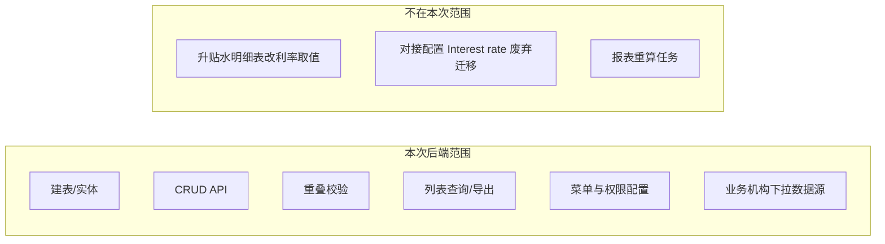

# 6-11号主数据利率配置 — 后端开发任务

> **关联文档**
> - [[升贴水报表涉及主数据优化V1.0]] — 升贴水主数据优化总需求（含 6.11 背景与方案）
> - [[6-11号主数据利率日期范围配置及升贴水明细表功能优化]] — 利率主数据需求文档（实施依据：**最终版**）

> [!info] 文档用途
> 供 Cursor / 后端开发按任务拆解实施。需求依据为 [[6-11号主数据利率日期范围配置及升贴水明细表功能优化#最终版|6-11 需求文档 — 最终版]]（平铺明细列表交互）。
>
> **不在本次范围：** 升贴水明细表利息取值、多类型升贴水计价、报表重算触发。

---

## 1. 最终版需求摘要

### 1.1 功能目标

在 **业务主数据 → 利率**（三级菜单，位于「单位转换」之后）提供利率主数据维护能力：

- 维度：**业务机构 + 生效日期范围**
- 配置项：**年利率（%）**、**年计息天数**、**备注**
- 约束：同一业务机构下，**日期范围不允许重叠**
- 生效：保存后供后续报表按新利率取数（报表改造另案）

### 1.2 页面能力（后端需支撑）

| 能力 | 说明 |
|------|------|
| 列表查询 | 查询条件：业务机构（必填项但允许空值=查全部）；列表平铺展示全部利率配置行 |
| 新建 | 弹窗保存一条配置 |
| 编辑 | 选中行后编辑 |
| 删除 | 选中行后删除 |
| 导出 | 导出当前查询结果（平铺格式） |

### 1.3 弹窗字段

| 字段 | 英文名 | 必填 | 规则 |
|------|--------|------|------|
| 生效日期范围 | Effective Date Range | 是 | 起止日期；如 2026-01-01 ~ 2026-11-01 |
| 业务机构 | Business Entity | 是 | 单选；取已启用业务机构【公司全称】 |
| 年利率（%） | Annual Interest Rate (%) | 是 | 数值，5 位小数，0–100 |
| 年计息天数 | Annual Interest Days | 是 | 正整数，默认 365 |
| 备注 | Remark | 否 | ≤ 100 字符 |

### 1.4 列表字段

| 列 | 说明 |
|----|------|
| 选择框 | 单选，供编辑/删除 |
| 序号 | 按创建时间戳生成，排序在前 |
| 生效日期范围 | 来自弹窗 |
| 业务机构 | 来自弹窗 |
| 年利率（%） | 来自弹窗 |
| 年计息天数 | 来自弹窗 |
| 备注 | 来自弹窗 |

### 1.5 唯一性校验与错误提示

保存时校验：**同一业务机构，不允许存在任何日期范围重叠的配置。**

> 需求原文注释：业务机构为空时（默认全部业务机构生效），也需满足该校验。

失败提示（中英文）：

```text
该业务机构存在日期范围重叠的利率配置。
Overlapping rate configurations for this business org.
```

---

## 2. 开发范围边界



---

## 3. 待开发前必须确认的事项

> [!warning] 需求歧义 — 开发前与产品确认并写入实现

| # | 问题 | 建议默认方案 | 影响 |
|---|------|-------------|------|
| 1 | **业务机构是否允许为空？** 弹窗写「必填」，唯一性注释写「为空=全部机构生效」 | 若最终版原型无「全部机构」选项，则 **不允许 NULL**，`legal_entity_id` 必填 | 表结构、校验、下拉接口 |
| 2 | **日期区间边界** 起止日期是否均含当天？ | 建议 **闭区间** `[start, end]`，与 `BETWEEN` 语义一致 | 重叠算法、报表匹配 |
| 3 | **开始日期 vs 结束日期** | `effective_start <= effective_end`，否则拒绝保存 | 参数校验 |
| 4 | **列表默认排序** | 需求写「按创建时间戳，排序在前」→ 建议 `created_time DESC, id DESC` | 列表 SQL |
| 5 | **【代码】字段** | 最终版弹窗描述提到「置于【代码】字段后」，但字段列表未定义代码 | 与前端/产品确认是否省略；**后端首版可不建 code 字段** |
| 6 | **删除方式** | 物理删除 or 逻辑删除（`inactive_flag`） | 需对齐 HME 其它主数据惯例 |
| 7 | **导出格式** | Excel 列与列表一致 | 复用现有导出框架 |

---

## 4. 数据库设计

### 4.1 建议表名

```text
systemdb.interest_rate_config
```

> 命名可按项目既有主数据表规范微调；关键是 **一机构多时间段平铺存储**。

### 4.2 字段设计

| 字段                     | 类型            | 必填  | 说明                                  |
| ---------------------- | ------------- | --- | ----------------------------------- |
| `id`                   | BIGINT PK     | 是   | 主键                                  |
| `legal_entity_id`      | BIGINT        | 待定  | 业务机构 ID，关联 `admindb.sys_company.ID` |
| `effective_start`      | DATE          | 是   | 生效开始日期                              |
| `effective_end`        | DATE          | 是   | 生效结束日期                              |
| `annual_rate`          | DECIMAL(8,5)  | 是   | 年利率，如 4.40000 表示 4.4%               |
| `annual_interest_days` | INT           | 是   | 年计息天数，默认 365                        |
| `remark`               | VARCHAR(1000) | 否   | 备注                                  |
| `created_by`           | BIGINT        | 是   | 创建人                                 |
| `created_time`         | DATETIME      | 是   | 创建时间（列表序号/排序依据）                     |
| `updated_by`           | BIGINT        | 否   | 更新人                                 |
| `updated_time`         | DATETIME      | 否   | 更新时间                                |
| `inactive_flag`        | TINYINT/CHAR  | 否   | 若项目主数据用逻辑删除则加                       |

### 4.3 索引

```sql
-- 列表按机构筛选
CREATE INDEX idx_interest_rate_legal_entity ON interest_rate_config (legal_entity_id);

-- 重叠校验 & 将来报表按日期匹配
CREATE INDEX idx_interest_rate_entity_date ON interest_rate_config (legal_entity_id, effective_start, effective_end);
```

### 4.4 关联

- 业务机构：`legal_entity_id` → `admindb.sys_company`
- 列表/导出展示机构全称：JOIN `sys_company`，取启用且有效的公司

---

## 5. API 设计（建议）

> 路径命名对齐项目现有 Controller 风格；以下为建议契约，实施时以代码库既有主数据模块为准（可参考「单位转换」同级菜单对应接口）。

### 5.1 列表查询

```http
GET /api/master-data/interest-rate/list
```

**Query**

| 参数 | 类型 | 必填 | 说明 |
|------|------|------|------|
| `legalEntityId` | Long | 否 | 业务机构 ID；空=查全部 |
| `pageNum` | Int | 否 | 分页 |
| `pageSize` | Int | 否 | 分页 |

**Response 单行**

```json
{
  "id": 1,
  "legalEntityId": 1001,
  "legalEntityName": "HME Brass Italy SpA",
  "effectiveStart": "2026-01-01",
  "effectiveEnd": "2026-11-01",
  "annualRate": 4.40000,
  "annualInterestDays": 365,
  "remark": "",
  "createdTime": "2026-06-15T10:00:00"
}
```

**排序：** `created_time DESC`

---

### 5.2 详情

```http
GET /api/master-data/interest-rate/{id}
```

---

### 5.3 新建

```http
POST /api/master-data/interest-rate
```

**Body**

```json
{
  "legalEntityId": 1001,
  "effectiveStart": "2026-01-01",
  "effectiveEnd": "2026-11-01",
  "annualRate": 4.40000,
  "annualInterestDays": 365,
  "remark": ""
}
```

**校验顺序建议：**

1. 字段非空 / 格式 / 范围
2. `effectiveStart <= effectiveEnd`
3. 业务机构存在且已启用
4. 同机构日期重叠校验
5. 入库

---

### 5.4 编辑

```http
PUT /api/master-data/interest-rate/{id}
```

- Body 同新建
- 重叠校验时 **排除当前 `id`**

---

### 5.5 删除

```http
DELETE /api/master-data/interest-rate/{id}
```

- 支持单条删除（与 UI「选中单据删除」一致）
- 是否逻辑删除按项目惯例

---

### 5.6 导出

```http
GET /api/master-data/interest-rate/export
```

- Query 与列表一致
- 导出列：序号、生效日期范围、业务机构、年利率（%）、年计息天数、备注

---

### 5.7 业务机构下拉（可复用现有接口）

若已有「已启用业务机构」通用接口，直接复用；否则提供：

```http
GET /api/master-data/legal-entities/enabled
```

数据源：`admindb.sys_company`，条件：启用 + 有效。

---

## 6. 核心业务逻辑

### 6.1 日期重叠判定

同一 `legal_entity_id` 下，新区间 `[newStart, newEnd]` 与已有区间 `[existStart, existEnd]` 重叠条件（闭区间）：

```text
newStart <= existEnd AND newEnd >= existStart
```

**伪代码：**

```java
boolean overlaps(LocalDate newStart, LocalDate newEnd,
                 LocalDate existStart, LocalDate existEnd) {
    return !newStart.isAfter(existEnd) && !newEnd.isBefore(existStart);
}
```

**SQL 查潜在冲突（编辑时加 `AND id != #{excludeId}`）：**

```sql
SELECT COUNT(1)
FROM interest_rate_config
WHERE legal_entity_id = #{legalEntityId}
  AND inactive_flag = 'N'           -- 若使用逻辑删除
  AND effective_start <= #{effectiveEnd}
  AND effective_end >= #{effectiveStart}
  AND (#{excludeId} IS NULL OR id != #{excludeId})
```

`COUNT > 0` → 返回业务错误码 + 固定提示文案。

---

### 6.2 参数校验规则

| 字段 | 规则 |
|------|------|
| `annualRate` | `0 <= rate <= 100`；存储/展示保留 5 位小数 |
| `annualInterestDays` | 正整数，`>= 1`；新建默认 365 |
| `remark` | 长度 ≤ 100 |
| `effectiveStart/End` | 合法日期；start ≤ end |

---

### 6.3 供将来报表使用的查询方法（本次仅预留 Service 方法）

> 报表改造不在本次范围，但建议 Service 层预留，避免后续重复写 SQL。

```java
/**
 * 按业务机构 + 目标日期匹配生效中的利率配置
 * @return 匹配到的 rate + annualInterestDays；未匹配时返回 empty 或抛业务异常（规则待定）
 */
Optional<InterestRateConfig> findEffectiveRate(Long legalEntityId, LocalDate targetDate);
```

匹配 SQL：

```sql
SELECT *
FROM interest_rate_config
WHERE legal_entity_id = #{legalEntityId}
  AND #{targetDate} BETWEEN effective_start AND effective_end
  AND inactive_flag = 'N'
LIMIT 1
```

---

## 7. 开发任务拆解

> 每项附 **verify** 验收标准，便于 Cursor 分步实施与自测。

### Task 1 — 数据库脚本

**内容：**

- 新建 `interest_rate_config` 表
- 索引
- 如有全量配置表发布流程，补充 `systemdb` 脚本

**verify：**

- [ ] 本地库可建表成功
- [ ] 字段类型与 DECIMAL(8,5) 精度满足 5 位小数

---

### Task 2 — 实体 / Mapper / XML

**内容：**

- Entity / DTO / Query / VO
- Mapper：insert、updateById、deleteById、selectById、selectList、countOverlap、selectEffectiveRate

**verify：**

- [ ] Mapper 单元测试或 SQL 手工验证 CRUD 正常

---

### Task 3 — Service 层

**内容：**

- `create` / `update` / `delete` / `getById` / `list` / `export`
- 封装 `validateRequest()` + `validateNoOverlap()`
- 业务机构有效性校验（查 `sys_company`）

**verify：**

- [ ] 新建合法数据成功
- [ ] 重叠区间被拒绝并返回指定中英文提示
- [ ] 编辑排除自身后，边界相接（如 2026-06-30 与 2026-07-01）不判重叠
- [ ] 编辑后与原区间重叠被拒绝
- [ ] 年利率 100.00001 被拒绝；0 和 100 边界通过
- [ ] 年计息天数 0 或负数被拒绝

---

### Task 4 — Controller 层

**内容：**

- REST 接口暴露
- 统一异常 → 业务错误码 + 文案
- 分页、导出接现有框架

**verify：**

- [ ] Postman / Swagger 可调通全部接口
- [ ] 错误场景 HTTP 状态与 body 符合项目规范

---

### Task 5 — 菜单 / 权限 / 国际化

**内容：**

- 菜单：**业务主数据 → 利率**（位于「单位转换」后）
- 配置 `web_forms` / 权限点（对齐同级主数据）
- `lang_resources` 补充中英文：
  - 菜单名、字段名
  - 重叠错误提示

**verify：**

- [ ] UAT/本地菜单可见且顺序正确
- [ ] 无权限账号不可调用写接口

---

### Task 6 — 导出

**内容：**

- 按查询条件导出 Excel
- 列与列表一致；日期范围格式 `yyyy-MM-dd ~ yyyy-MM-dd`

**verify：**

- [ ] 导出条数与列表一致
- [ ] 机构名称、利率格式正确

---

### Task 7 — 联调支持（不含报表）

**内容：**

- 与前端联调列表、新建、编辑、删除、导出
- 确认业务机构下拉数据正确

**verify：**

- [ ] 前端全链路走通
- [ ] 最终版原型所列字段均有数据来源

---

## 8. 注意事项

### 8.1 与现有「对接配置 Interest rate」的关系

历史方案在 **对接配置** 中维护固定利率 4.4%（`dockingMark = Interest rate`），见 [[升贴水报表涉及主数据优化V1.0#1、报表修改|升贴水主数据优化 V1.0 — 利率配置]]。

- **本次只做主数据新表与新接口**，不修改升贴水报表取值
- 将来报表改造切主数据后，对接配置是否废弃需另开任务
- 避免两处同时生效导致口径不一致（当前无冲突，因报表尚未切源）

### 8.2 业务机构数据源

- 表：`admindb.sys_company`
- 字段：`legal_entity_id` / 公司全称
- 仅返回 **已启用** 机构（条件对齐【业务机构管理】现有逻辑）

### 8.3 并发

- 重叠校验必须在 **事务内** 完成：`SELECT count` + `INSERT/UPDATE` 同一事务
- 防止并发新建导致重叠漏检

### 8.4 精度

- 利率用 `DECIMAL`，**禁止 float/double 直接比较**
- API 返回与存储统一 5 位小数

### 8.5 删除

- 若已有报表引用历史利率配置，物理删除可能影响审计
- **建议优先逻辑删除**；若产品坚持物理删除，需确认无 FK 约束

### 8.6 不做过度设计

- 不引入「机构主表 + 子表」双表模型
- 不做审批流、版本历史、生效定时任务（需求未要求）
- 不做报表重算触发（需求未要求）

---

## 9. 测试用例清单（最小集）

| # | 场景 | 输入 | 期望 |
|---|------|------|------|
| T1 | 正常新建 | 机构 A，2026-01-01~2026-12-31，4.4%，365 | 成功 |
| T2 | 同机构不重叠第二段 | 机构 A，2027-01-01~2027-12-31 | 成功 |
| T3 | 同机构重叠 | 机构 A，2026-06-01~2027-06-30 | 失败，固定提示文案 |
| T4 | 边界相接 | 机构 A，2026-01-01~2026-06-30 与 2026-07-01~2026-12-31 | 均成功（闭区间下不重叠） |
| T5 | 跨机构同日期 | 机构 B，2026-01-01~2026-12-31 | 成功（不跨机构校验） |
| T6 | 开始>结束 | 2026-12-31~2026-01-01 | 失败 |
| T7 | 利率超范围 | 100.00001 或 -0.00001 | 失败 |
| T8 | 计息天数非法 | 0 / -1 / 1.5 | 失败 |
| T9 | 编辑自身不改日期 | 修改备注 | 成功 |
| T10 | 编辑造成重叠 | 修改 end 日期跨入另一段 | 失败 |
| T11 | 列表筛选 | legalEntityId=某机构 | 仅返回该机构 |
| T12 | 列表排序 | 新建两条 | 后创建排在前面 |
| T13 | 导出 | 有筛选条件 | 与列表一致 |

---

## 10. Cursor 推荐实施顺序

```text
1. 在代码库定位「单位转换」同级主数据模块 → 复制分层结构（Controller/Service/Mapper）
2. Task 1 建表
3. Task 2 Mapper + Task 3 Service（先写 overlap 校验单元测试）
4. Task 4 Controller
5. Task 5 菜单权限
6. Task 6 导出
7. Task 7 联调
```

**Cursor 提示词建议（首条）：**

```text
请阅读 [[6-11号主数据利率日期范围配置及升贴水明细表功能优化-后端开发任务]]
及 [[6-11号主数据利率日期范围配置及升贴水明细表功能优化#最终版]]，
在 [具体模块路径] 参照 [单位转换/同类主数据] 实现 interest_rate_config 的 CRUD。
先实现重叠校验 Service 及测试，再暴露 API。不要改动升贴水报表相关代码。
```

---

## 11. 参考文档

| 文档 | 用途 |
|------|------|
| [[6-11号主数据利率日期范围配置及升贴水明细表功能优化#最终版\|6-11 需求文档 — 最终版]] | UI 与业务规则来源 |
| [[升贴水报表涉及主数据优化V1.0]] | 升贴水主数据优化总需求、历史对接配置利率背景（4.4%） |
| [[HME数据库]] | `sys_company`、配置表、脚本发布说明 |

---

## 12. 完成定义（Definition of Done）

- [ ] `interest_rate_config` 表及脚本已提交
- [ ] 列表 / 新建 / 编辑 / 删除 / 导出 API 可用
- [ ] 同机构日期重叠校验生效，错误文案与需求一致
- [ ] 菜单「业务主数据 → 利率」可访问
- [ ] 第 9 节测试用例 T1–T13 通过
- [ ] **未改动** 升贴水明细表及报表利率取值逻辑
